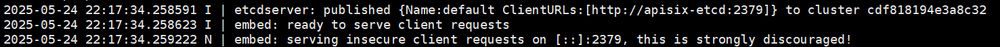

## 申明

### 版本说明

APISIX 版本：`3.12`

官方文档：https://apisix.apache.org/zh/docs/apisix/getting-started/README/

注意这个链接为最新版本文档，如果读者在阅读 APISIX 官方文档时发现版本不是上述版本，可在 Version 选项中找到对应版本文档。


本文使用到如下 docker 镜像容器，参考版本是文档给出的一键快速启动脚本：https://run.api7.ai/apisix/quickstart，考虑该链接内容可能随着版本升级而更新，本文粘贴出当前`3.12`版本所使用到脚本：

```shell
#!/bin/bash

#
# Licensed to the Apache Software Foundation (ASF) under one or more
# contributor license agreements.  See the NOTICE file distributed with
# this work for additional information regarding copyright ownership.
# The ASF licenses this file to You under the Apache License, Version 2.0
# (the "License"); you may not use this file except in compliance with
# the License.  You may obtain a copy of the License at
#
#     http://www.apache.org/licenses/LICENSE-2.0
#
# Unless required by applicable law or agreed to in writing, software
# distributed under the License is distributed on an "AS IS" BASIS,
# WITHOUT WARRANTIES OR CONDITIONS OF ANY KIND, either express or implied.
# See the License for the specific language governing permissions and
# limitations under the License.
#

DEFAULT_ETCD_IMAGE_NAME="bitnami/etcd"
DEFAULT_ETCD_IMAGE_TAG="3.5.7"

DEFAULT_APISIX_IMAGE_NAME="apache/apisix"
DEFAULT_APISIX_IMAGE_TAG="3.12.0-debian"

DEFAULT_ETCD_LISTEN_PORT=2379
DEFAULT_APISIX_PORT=9180

DEFAULT_ETCD_NAME="etcd-quickstart"
DEFAULT_APP_NAME="apisix-quickstart"
DEFAULT_NET_NAME="apisix-quickstart-net"

usage() {
  echo "Runs a Docker based Apache APISIX."
  echo
  echo "See the document for more information:"
  echo "  https://docs.api7.ai/apisix/getting-started"
  exit 0
}

echo_fail() {
  printf "\e[31m✘ \e[0m$@\n"
}

echo_pass() {
  printf "\e[32m✔ \e[0m$@\n"
}

echo_warning() {
  printf "\e[33m⚠ $@\e[0m\n"
}

ensure_docker() {
  {
    docker ps -q >/dev/null 2>&1
  } || {
    return 1
  }
}

ensure_curl() {
  {
    curl -h >/dev/null 2>&1
  } || {
    return 1
  }
}

install_apisix() {

  echo "Installing APISIX with the quickstart options."
  echo ""

  echo "Creating bridge network ${DEFAULT_NET_NAME}."

  docker network create -d bridge $DEFAULT_NET_NAME && echo_pass "network ${DEFAULT_NET_NAME} created" || {
    echo_fail "Create network failed!"
    return 1
  }

  echo ""

  echo "Starting the container ${DEFAULT_ETCD_NAME}."
  docker run -d \
    --name ${DEFAULT_ETCD_NAME} \
    --network=$DEFAULT_NET_NAME \
    -e ALLOW_NONE_AUTHENTICATION=yes \
    -e ETCD_ADVERTISE_CLIENT_URLS=http://${DEFAULT_ETCD_NAME}:${DEFAULT_ETCD_LISTEN_PORT} \
    ${DEFAULT_ETCD_IMAGE_NAME}:${DEFAULT_ETCD_IMAGE_TAG} && echo_pass "etcd is listening on ${DEFAULT_ETCD_NAME}:${DEFAULT_ETCD_LISTEN_PORT}" || {
    echo_fail "Start etcd failed!"
    return 1
  }

  echo ""

  APISIX_DEPLOYMENT_ETCD_HOST="[\"http://${DEFAULT_ETCD_NAME}:${DEFAULT_ETCD_LISTEN_PORT}\"]"

  echo "Starting the container ${DEFAULT_APP_NAME}."
  docker run -d \
    --name ${DEFAULT_APP_NAME} \
    --network=$DEFAULT_NET_NAME \
    -p9080:9080 -p9180:9180 -p9443:9443/tcp -p9443:9443/udp -p9090:9092 -p9100:9100 -p9091:9091 \
    -e APISIX_DEPLOYMENT_ETCD_HOST=${APISIX_DEPLOYMENT_ETCD_HOST} \
    ${DEFAULT_APISIX_IMAGE_NAME}:${DEFAULT_APISIX_IMAGE_TAG} && validate_apisix && sleep 2 || {
    echo_fail "Start APISIX failed!"
    return 1
  }

  docker exec ${DEFAULT_APP_NAME} /bin/bash -c "echo '
apisix:
  enable_control: true
  control:
    ip: "0.0.0.0"
    port: 9092
deployment:
  role: traditional
  role_traditional:
    config_provider: etcd
  admin:
    admin_key_required: false
    allow_admin:
      - 0.0.0.0/0
plugin_attr:
  prometheus:
    export_addr:
      ip: 0.0.0.0
      port: 9091
  ' > /usr/local/apisix/conf/config.yaml"
  docker exec ${DEFAULT_APP_NAME} apisix reload >>/dev/null 2>&1

  echo_warning "WARNING: The Admin API key is currently disabled. You should turn on admin_key_required and set a strong Admin API key in production for security."

  echo ""
}

destroy_apisix() {
  echo "Destroying existing ${DEFAULT_APP_NAME} container, if any."
  echo ""
  docker rm -f $DEFAULT_APP_NAME >>/dev/null 2>&1
  docker rm -f $DEFAULT_ETCD_NAME >>/dev/null 2>&1
  docker network rm $DEFAULT_NET_NAME >>/dev/null 2>&1
  sleep 2
}

validate_apisix() {
  local rv=0
  retry 30 curl "http://localhost:${DEFAULT_APISIX_PORT}/apisix/admin/services" >>/dev/null 2>&1 && echo_pass "APISIX is up" || rv=$?
}

main() {
  ensure_docker || {
    echo_fail "Docker is not available, please install it first"
    exit 1
  }

  ensure_curl || {
    echo_fail "curl is not available, please install it first"
    exit 1
  }

  destroy_apisix

  install_apisix || {
    exit 1
  }

  echo_pass "APISIX is ready!"
}

main "$@"

```

从上述脚本可以看出，使用 docker 镜像版本信息如下：

| 镜像          | 版本          | 备注           |
| ------------- | ------------- | -------------- |
| bitnami/etcd  | 3.5.7         | 暴露端口：2379 |
| apache/apisix | 3.12.0-debian | 暴露端口：9180 |

在两个容器启动之后，会更新 apisix 容器中的`/usr/local/apisix/conf/config.yaml`配置。

### 自定义配置文件

笔者参考官网一键快速启动脚本、官网文档、github 仓库的`config.yaml`，自定义了如下 apisix 的配置，在下文的启动 apisix 服务中会使用到。

> 注意：`${ETCD_HOST}`需要配置为宿主机的 IP 地址或者 ETCD 服务的容器名称

```yaml
apisix:
  enable_control: true
  control:
    ip: 0.0.0.0
    port: 9092
deployment:
  role: traditional
  role_traditional:
    config_provider: etcd
  etcd:
    host:
      - http://${ETCD_HOST}:2379
  admin:
    admin_key:
      - name: admin
        key: admin
        role: admin
    allow_admin:
      - 0.0.0.0/0
plugin_attr:
  log-rotate:
    interval: 3600
    max_kept: 168
    max_size: -1
    enable_compression: false
  file-logger:
    path: logs/file.log
```

上述配置了`log-rotate`、`file-logger`插件的参数：

**log-rotate 插件**

> `log-rotate` 插件用于定期切分日志目录下的访问日志和错误日志。

interval，每间隔多长时间切分一次日志，以秒为单位。

max_kept，最多保留多少份历史日志，超过指定数量后，自动删除老文件。

max_size，日志文件超过指定大小时进行切分，单位为 Byte。如果 `max_size` 小于 0 或者根据 `interval` 计算的时间到达时，将不会根据 `max_size` 切分日志。

enable_compression，当设置为 `true` 时，启用日志文件压缩。该功能需要在系统中安装 `tar` 。

**file-logger 插件**

> `file-logger`插件可用于将日志数据存储到指定位置。

path，自定义输出文件路径。

## docker 创建网络

创建`apisix-net`网络

```shell
docker network create apisix-net
```

## docker 安装 etcd

**步骤1**：拉去 docker 镜像：

```shell
docker pull bitnami/etcd:3.4.9
```

**步骤2**：在宿主机中创建 etcd 要挂载的目录：

```shell
mkdir -p /home/etcd/etcd_data
```

**步骤3**：获取 etcd 容器的用户信息：

```shell
docker inspect bitnami/etcd:3.4.9 | grep -i user
```


**步骤4**：授权文件夹权限：

```shell
chown -R 1001:1001 /home/etcd/etcd_data
```

**步骤5**：启动脚本：

```shell
docker run -d --name apisix-etcd \
--restart=always \
--network=apisix-net \
-e TZ=Asia/Shanghai \
-p 2379:2379 \
-v /home/etcd/etcd_data:/etcd_data \
-e "ETCD_DATA_DIR=/etcd_data" \
-e "ETCD_ENABLE_V2=true" \
-e "ALLOW_NONE_AUTHENTICATION=yes" \
-e "ETCD_ADVERTISE_CLIENT_URLS=http://apisix-etcd:2379" \
-e "ETCD_LISTEN_CLIENT_URLS=http://0.0.0.0:2379" \
bitnami/etcd:3.4.9
```

**步骤6**：验证是否安装成功

- 方式1：查看容器日志

查看容器日志，出现 serving insecure client requests on [::]:2379, this is strongly discouraged! 字样表示启动成功

```shell
docker logs apisix-etcd
```



- 方式2：etcd 可视化工具链接测试

下载 etcd-workbench 客户端工具，github 仓库地址：https://github.com/tzfun/etcd-workbench/releases

配置好 etcd 链接信息，点击测试链接，提示链接成功即可。


## docker 安装 apisix

**步骤1**：拉去 docker 镜像：

```shell
docker pull apache/apisix:3.12.0-debian
```

**步骤2**：在宿主机中创建 apisix 要挂载的目录：

```shell
mkdir -p /home/apisix
```

**步骤3**：将上章节自定义 config.yaml 脚本创建到 apisix 要挂载的目录。

```shell
touch /home/apisix/config.yaml
```

笔者写入的配置如下，注意下述配置了一个账号名为`admin`，密码为`admin`的管理员账号，强烈建议读者使用复杂的数值，例如 ：`edd1c9f034335f136f87ad84b625c8f1 `

> 可使用 1password 快速随机生成密码 https://1password.com/zh-cn/password-generator

```yaml
apisix:
  enable_control: true
  control:
    ip: 0.0.0.0
    port: 9092
deployment:
  role: traditional
  role_traditional:
    config_provider: etcd
  etcd:
    host:
      # 配置外部 etcd 服务地址
      - http://apisix-etcd:2379
  admin:
    admin_key:
      - name: admin
        key: admin
        role: admin
    allow_admin:
      - 0.0.0.0/0
plugins:
  - jwt-auth
  - proxy-rewrite
  - public-api
  - log-rotate
  - file-logger
  - limit-count
  - request-id
plugin_attr:
  log-rotate:
    interval: 3600
    max_kept: 168
    max_size: -1
    enable_compression: false
  file-logger:
    # 配置日志输出路径
    path: logs/file.log
```

**步骤4**：启动脚本：

```shell
docker run -d --name apisix \
--restart=always \
--user=root \
-e TZ=Asia/Shanghai \
--network=apisix-net \
-v /home/apisix/config.yaml:/usr/local/apisix/conf/config.yaml \
-p 9180:9180 \
-p 9080:9080 \
-p 9092:9092 \
-p 9091:9091 \
apache/apisix:3.12.0-debian
```

**步骤5**：验证是否安装成功：

```shell
curl "http://127.0.0.1:9080" --head | grep Server
```

出现 Server: APISIX/Version 字样表示安装成功


```
docker exec -it apisix sh -c "netstat -tuln || ss -tuln"
```
