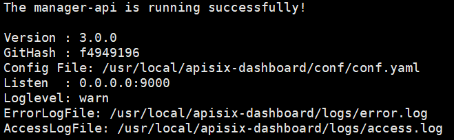
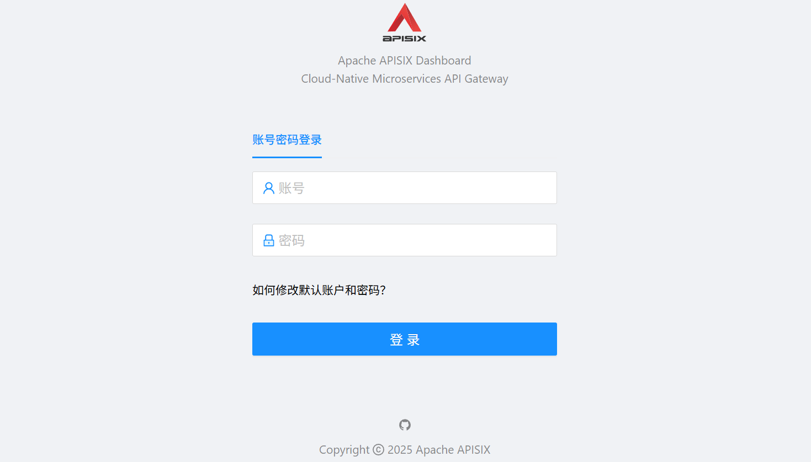

## 申明

APISIX Dashboard 版本：`3.0.0`

官方文档：https://apisix.apache.org/zh/docs/dashboard/USER_GUIDE/

## docker 创建网络

创建`apisix-net`网络

```shell
docker network create apisix-net
```

如果提示错误信息：Error response from daemon: network with name apisix-net already exists，表示该网络名称已存在，没有关系，这里赘述创建网络是保证网络一定存在。

## docker 安装 APISIX Dashboard

**步骤1**：拉取镜像

```shell
docker pull apache/apisix-dashboard:3.0.1-centos
```

**步骤2**：创建 apisix-dashboard 数据存储目录

```shell
mkdir -p /home/apisix-dashboard/logs
```

**步骤3**：从 apisix 获取所有插件信息

```shell
curl http://127.0.0.1:9092/v1/schema -H "X-API-KEY: admin" > /home/apisix-dashboard/schema.json
```

其中：`X-API-KEY` 是 apisix 配置文件中配置的`admin_key`

**步骤4**：自定义配置

启动必须提前在宿主机中写一份 config.yaml 文件，挂在并覆盖容器中的配置，配置文件参考：https://github.com/apache/apisix-dashboard/blob/release/3.0/api/test/docker/manager-api-conf.yaml

```shell
vim /home/apisix-dashboard/conf.yaml
```

写入下述配置：

```shell
conf:
  listen:
    host: 0.0.0.0           
    port: 9000
  etcd:
    endpoints:
      # etcd 认证账号
      # username: "root"
      # etcd 认证密码
      # password: "123456"
      # etcd 配置列表。如果有 etcd 集群，则需要全部配置上
      - apisix-etcd:2379
  log:
    error_log:
      level: warn
      file_path: logs/error.log    
authentication:
  # 用户登录成功时生成 jwt token 的密钥，不配置则系统随机生成
  # secret: 
  # 用户登录成功之后的 jwt token 的过期时间，单位：秒
  expire_time: 3600
  users:
    # 控制台登录账号密码，生产环境强烈建议设置成更复杂的密码
    - username: admin
      password: admin
```

**步骤5**：启动 APISIX Dashboard

```shell
docker run -d --name apisix-dashboard \
--restart=always \
--user=root \
--network=apisix-net \
-e TZ=Asia/Shanghai \
-p 9400:9000 \
-v /home/apisix-dashboard/conf.yaml:/usr/local/apisix-dashboard/conf/conf.yaml \
-v /home/apisix-dashboard/logs:/usr/local/apisix-dashboard/logs \
apache/apisix-dashboard:3.0.0-centos
```

**步骤6**：查看是否启动成功

```shell
docker logs apisix-dashboard
```

出现 The manager-api is running successfully! 字样，表示启动成功



**步骤7**：浏览器访问：http://宿主机IP:9400 即可进入 apisix 控制台登录页面



账号密码为`/home/apisix-dashboard/conf.yaml`配置文件中配置的`authentication.users`用户信息。

**步骤8**：账号密码修改

因为控制台系统页面不提供账号密码修改操作，所以上述配置中`authentication.users`的账号密码是唯一可以修改的地方，修改之后需要重启容器：

```shell
docker restart apisix-dashboard
```
