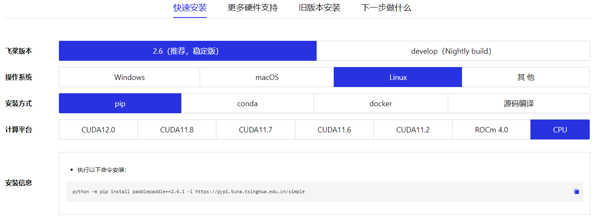
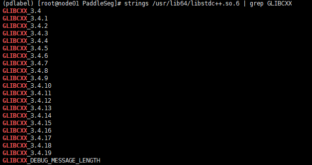
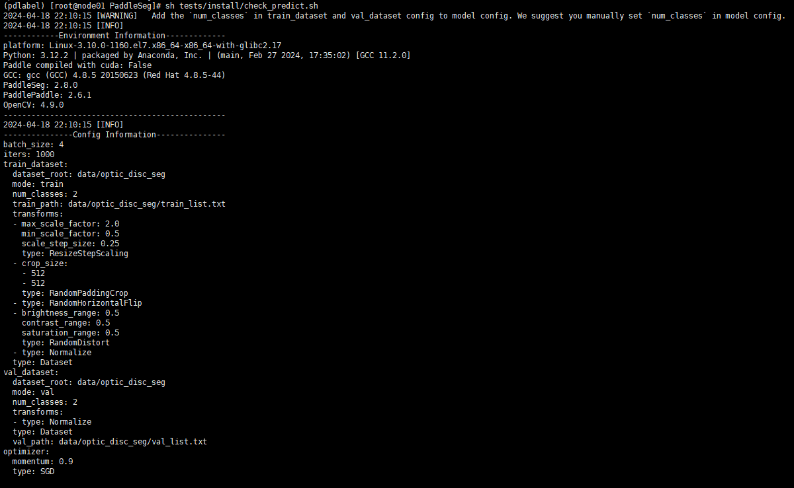
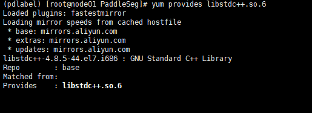
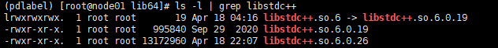
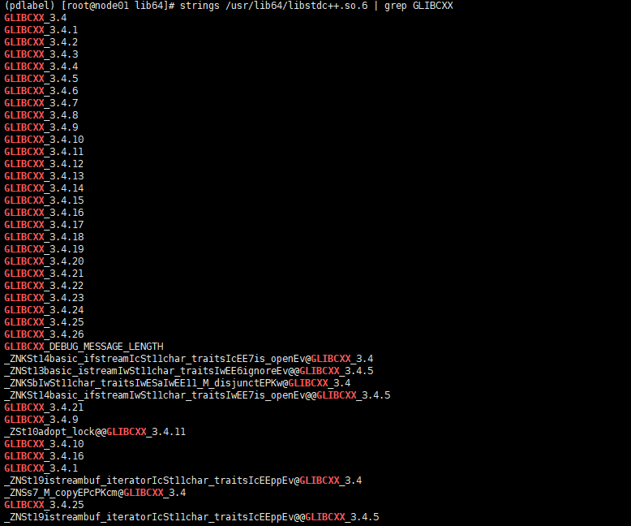

PaddleSeg 安装指南

## 环境说明

- CentOS Linux release 7.9.2009 (Core)
- Linux version 3.10.0-1160.el7.x86_64

- conda 24.1.2

- Python 3.12.2

- pip 23.3.1
- git version 1.8.3.1

## 前期准备

**步骤1**：创建 pdlabel 环境

```shell
conda create -n pdlabel
```

**步骤2**：切换至 pdlabel 环境

```shell
conda activate pdlabel
```

**步骤3**：检查 pip 是否安装

```shell
pip -V
```

pip 源设置为清华源：

```shell
pip config set global.index-url https://pypi.tuna.tsinghua.edu.cn/simple
```

> 如果没有安装，则执行：`conda install -y pip`

**步骤4**：检查 git 是否安装

```shell
git --version
```

> 如果没有安装，则执行：`yum install -y git`

**步骤5**：安装 paddlepaddle

> 官网快速安装文档：https://www.paddlepaddle.org.cn/install/quick?docurl=/documentation/docs/zh/install/pip/linux-pip.html

笔者安装的计算平台是：CPU



```shell
python -m pip install paddlepaddle==2.6.1 -i https://pypi.tuna.tsinghua.edu.cn/simple
```

**步骤6**：检查 libstdc++.so.6

```shell
strings /usr/lib64/libstdc++.so.6 | grep GLIBCXX
```

> 如果是如下信息，少了 GLIBCXX_3.4.20，则需要进行 libstdc++ 升级，升级步骤参加下文："libstdc++.so.6 问题"
>
> 

**步骤7**：安装 opencv-python-headless

```shell
pip install opencv-python-headless -i https://pypi.tuna.tsinghua.edu.cn/simple
```

## 安装 PaddleSeg

**步骤1**：从Github下载PaddleSeg代码

```shell
git clone https://github.com/PaddlePaddle/PaddleSeg
```

> 下载慢可以增加代理：
>
> ```shell
> git clone https://mirror.ghproxy.com/https://github.com/PaddlePaddle/PaddleSeg
> ```

**步骤2**：环境依赖包安装

执行如下命令，从源码编译安装PaddleSeg包。大家对于`PaddleSeg/paddleseg`目录下的修改，都会立即生效，无需重新安装。

```shell
cd PaddleSeg
pip install -r requirements.txt -i https://pypi.tuna.tsinghua.edu.cn/simple
pip install -v -e .
```

**步骤3**：安装 paddleseg

执行如下命令，安装发布的PaddleSeg包。

```shell
pip install paddleseg
```

**步骤4**：确认环境安装成功

在PaddleSeg目录下执行如下命令，会进行简单的单卡预测。查看执行输出的log，没有报错，则验证安装成功。

```shell
sh tests/install/check_predict.sh
```



## 常见问题

### libstdc++.so.6 问题

如果安装过程中出现：version `GLIBCXX_3.4.20' not found，则需要升级 libstdc++

**步骤1**：yum 查找 libstdc++.so.6

```shell
sudo yum provides libstdc++.so.6
```



**步骤2**：进入 /usr/local/lib64

```shell
cd /usr/local/lib64
```

**步骤3**：下载最新版本的 libstdc.so_.6.0.26

```shell
wget -P /usr/local/lib64 http://www.vuln.cn/wp-content/uploads/2019/08/libstdc.so_.6.0.26.zip
```

**步骤4**：解压 libstdc.so_.6.0.26.zip

```shell
unzip /usr/local/lib64/libstdc.so_.6.0.26.zip
```

> 如果没有 unzip 命令，则执行：`yum install -y unzip`

**步骤5**：将下载的最新版本拷贝到 /usr/lib64

```shell
cp /usr/local/lib64/libstdc++.so.6.0.26 /usr/lib64
```

**步骤6**：进入 /usr/lib64

```shell
cd /usr/lib64
```

**步骤7**：查看 /usr/lib64 下 libstdc++.so.6 链接的版本

```shell
ls -l /usr/lib64 | grep libstdc++
```



**步骤8**：删除 /usr/lib64 原来的软连接 libstdc++.so.6，删除之前先备份一份

```shell
rm /usr/lib64/libstdc++.so.6
```

**步骤9**：链接新的版本

```shell
ln -s /usr/lib64/libstdc++.so.6.0.26 /usr/lib64/libstdc++.so.6
```

**步骤10**：查看新版本，升级成功

```shell
strings /usr/lib64/libstdc++.so.6 | grep GLIBCXX
```



### ImportError: libGL.so.1 问题

安装 opencv-python-headless

```shell
pip install opencv-python-headless -i https://pypi.tuna.tsinghua.edu.cn/simple
```
