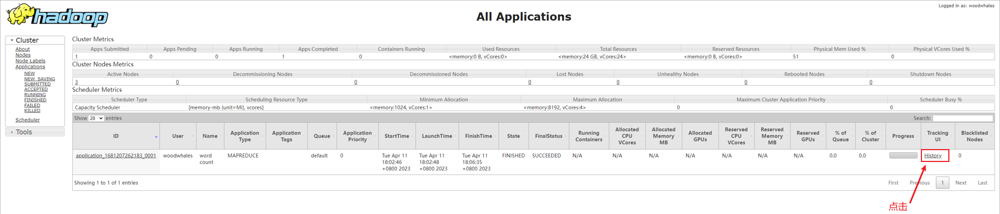

### 环境准备

#### 操作系统

查看版本

```sh
cat /etc/redhat-release
```

> 笔者使用的版本为：CentOS 7.9.2009

#### 主机名

查看主机名

```sh
hostname
```

设置主机名为：node01

```sh
hostnamectl set-hostname node01
```

#### JDK

查看 yum 可安装 JDK 包名

```sh
yum search openjdk
```

安装 JDK 11

```sh
yum -y install java-11-openjdk-devel.x86_64
```

安装完毕，验证是否安装成功

```sh
java -version
```

配置 JAVA_HOME 环境变量

```sh
vim /etc/profile
```

在 /etc/profile 文件末尾追加配置

```ini
export JAVA_HOME=/usr/lib/jvm/java-11-openjdk-11.0.18.0.10-1.el7_9.x86_64
export PATH=$PATH:$JAVA_HOME/bin
```

修改完成之后，执行生效配置命令

```sh
source /etc/profile
```

验证配置是否生效：

```sh
echo $PATH
```

控制台打印 JDK 相关信息表示配置成功

#### 防火墙

关闭防火墙

```sh
systemctl stop firewalld.service
```

禁止开机启动

```sh
systemctl disable firewalld.service
```

查看防火墙状态

```sh
systemctl status firewalld.service
```

#### 非ROOT用户

创建用户
```sh
useradd woodwhales
```

设置用户密码

```sh
passwd woodwhales
```

删除用户

```sh
userdel -r woodwhales
```

清除用户密码

```sh
passwd -d woodwhales
```

查看所有用户

```sh
cut -d : -f 1 /etc/passwd
```

> **设置普通 sudo 操作时不需要输入 root 账号密码**
>
> 步骤1：设置 /etc/sudoers 可编辑
>
> ```sh
>chmod u+w /etc/sudoers
> ```
> 
> 步骤2：编辑 /etc/sudoers 
>
> ```sh
>vim /etc/sudoers
> ```
> 
> 在`# %wheel        ALL=(ALL)       NOPASSWD: ALL`注释下面增加要设置的用户
>
> 
>
> 步骤3：收回 /etc/sudoers 编辑权限
>
> ```sh
>chmod u-w /etc/sudoers
> ```

## 安装 hadoop

步骤1：在 /opt/ 目录下创建 module 和 software 文件目录

```sh
mkdir /opt/module
mkdir /opt/software
```

步骤2：为步骤1 的文件目录设置所属用户

```sh
chown -R woodwhales:woodwhales /opt/module
chown -R woodwhales:woodwhales /opt/software
```

步骤3：下载 hadoop 安装包

官方地址：https://hadoop.apache.org/releases.html

历史版本官网地址：https://archive.apache.org/dist/hadoop/common/

清华镜像地址：https://mirrors.tuna.tsinghua.edu.cn/apache/hadoop/common/

阿里云镜像地址：https://mirrors.aliyun.com/apache/hadoop/common/

> 笔者下载的 hadoop 版本：hadoop-3.4.0.tar.gz

步骤4：上传至 /opt/module 文件目录

步骤5：解压 hadoop 文件夹

```sh
tar -zxvf hadoop-3.4.0.tar.gz -C /opt/module/
```

步骤6：配置 hadoop 环境变量

编辑 /etc/profile 配置

```sh
sudo vim /etc/profile
```

在文件末尾追加：

```ini
export HADOOP_HOME=/opt/module/hadoop-3.4.0
export PATH=$PATH:$HADOOP_HOME/bin:$HADOOP_HOME/sbin
```

保存成功之后，执行生效配置：

```sh
source /etc/profile
```

打印 PATH 环境变量验证配置是否生效：

```sh
echo $PATH
```

执行 hadoop 命令查看版本信息：
```sh
hadoop version
```


## hadoop 本地模式

在 /opt/module/hadoop-3.4.0/ 中创建 wcinput 文件目录：

```sh
mkdir /opt/module/hadoop-3.4.0/wcinput/
```

在 /opt/module/hadoop-3.4.0/wcinput/ 中创建 word.txt 文件：

```sh
touch /opt/module/hadoop-3.4.0/wcinput/word.txt
```

在 word.txt 文件中编写如下信息：

```txt
woodwhale yarn
woodwhales mapreduce
woodwhales hadoop
woodwhale hadoop
wood hdfs
whale
whale
```

执行 wordcount 数据统计：

```sh
hadoop jar /opt/module/hadoop-3.4.0/share/hadoop/mapreduce/hadoop-mapreduce-examples-3.4.0.jar wordcount /opt/module/hadoop-3.4.0/wcinput/ /opt/module/hadoop-3.4.0/wcoutput
```

执行成功之后，可以在 /opt/module/hadoop-3.3.1/wcoutput 文件目录中可见：

```ini
-rw-r--r--. 1 woodwhales woodwhales 75 4月   4 21:32 part-r-00000
-rw-r--r--. 1 woodwhales woodwhales  0 4月   4 21:32 _SUCCESS
```

其中：part-r-00000 是单词统计结果，_SUCCESS 的文件名表示本次计算任务执行结果状态

查看 part-r-00000 结果集：

```sh
cat /opt/module/hadoop-3.4.0/wcoutput/part-r-00000
```

得到如下结果：


## ssh 免密

步骤1：在各个 node01、node02、node03 服务器中配置 /etc/hosts

```shell
192.168.100.101 node01
192.168.100.102 node02
192.168.100.103 node03
```

重启网络：

```shell
systemctl restart network
```

 步骤2：分别在  node01、node02、node03 服务器上执行如下命令：

```sh
# 生成 ssh 密钥对
ssh-keygen -t rsa
```

三次回车之后，在 ~/.ssh 文件目录中生成：id_rsa（私钥）、id_rsa.pub（公钥）

步骤3：每个服务器分发自己的公钥到其他服务器中：

```sh
ssh-copy-id node01
ssh-copy-id node02
ssh-copy-id node03
```

例如：

node01 分发执行：

```shell
ssh-copy-id node02
ssh-copy-id node03
```

node02 分发执行：

```shell
ssh-copy-id node01
ssh-copy-id node03
```


## scp（secure copy）安全拷贝

scp 是 secure copy 的缩写，用于远程的文件的复制。

```sh
scp -r $pdir/$fname $user@$host:$pdir/$fname
```

-r： 递归复制整个目录。

示例1：在 node01 服务器上，将当前服务器的 /data/ 目录同步到 node02 服务器的 /data/ 目录

```sh
scp -r /data root@node02:/data/
```

示例2：在 node01 服务器上，将 node02 服务器的 /data/ 目录同步到 node03 服务器的 /data/ 目录

```sh
scp -r root@node02:/data/ root@node03:/data/
```

## rsync（增量同步）

rsync 就是"远程同步"（remote sync）的意思。rsync 的最大特点就是它可以完成增量备份，也就是默认只复制有变动的文件。

```sh
rsync -r source destination
```

上面命令中，-r 表示递归，即包含子目录。注意，-r 是必须的，否则 rsync 运行不会成功。source目录表示源目录，destination表示目标目录。

-a 参数可以替代 -r，除了可以递归同步以外，还可以同步元信息（比如修改时间、权限等）。由于 rsync 默认使用文件大小和修改时间决定文件是否需要更新，所以 -a 比 -r 更有用。下面的用法才是常见的写法。

```sh
rsync -a source destination
```

目标目录 destination 如果不存在，rsync 会自动创建。执行上面的命令后，源目录 source 被完整地复制到了目标目录 destination 下面，即形成了 destination/source 的目录结构。

如果只想同步源目录source里面的内容到目标目录destination，则需要在源目录后面加上斜杠。

```sh
rsync -av source/ destination
```

-v 参数表示输出细节。-vv 表示输出更详细的信息，-vvv 表示输出最详细的信息。

### 自定义增量同步脚本 rsync

在 /home/user/bin 中创建 rsync 文件：

```sh
touch /home/woodwhales/bin/rsync
```

rsync 内容如下：

```shell
#!/bin/bash

#1. 判断参数个数
if [ $# -lt 1 ]
then
    echo Not Enough Arguement!
    exit;
fi

#2. 遍历集群所有机器
for host in node01 node02 node03
do
    echo ====================  $host  ====================
    #3. 遍历所有目录，挨个发送

    for file in $@
    do
        #4. 判断文件是否存在
        if [ -e $file ]
            then
                #5. 获取父目录
                pdir=$(cd -P $(dirname $file); pwd)

                #6. 获取当前文件的名称
                fname=$(basename $file)
                ssh $host "mkdir -p $pdir"
                rsync -av $pdir/$fname $host:$pdir
            else
                echo $file does not exists!
        fi
    done
done

```

 修改脚本 rsync 具有执行权限

```sh
chmod +x rsync
```

使用命令：

```sh
/home/woodwhales/bin/rsync 要同步的文件全路径
```

## Hadoop 集群部署

### 集群部署规划

- NameNode和SecondaryNameNode不要安装在同一台服务器

- ResourceManager 也很消耗内存，不要和 NameNode、SecondaryNameNode 配置在同一台机器上。

|      | node01                | node02                          | node03                         |
| ---- | --------------------- | ------------------------------- | ------------------------------ |
| HDFS | NameNode<br/>DataNode | <br/>DataNode                   | SecondaryNameNode<br/>DataNode |
| YARN | <br/>NodeManager      | ResourceManager<br/>NodeManager | <br/>NodeManager               |

### 配置文件说明

hadoop 配置文件分两类：默认配置文件和自定义配置文件，只有用户想修改某一默认配置值时，才需要修改自定义配置文件，更改相应属性值。

（1）默认配置文件

| 默认文件           | 文件存放在 Hadoop 的 jar 包中的位置                          |
| ------------------ | ------------------------------------------------------------ |
| core-default.xml   | $HADOOP_HOME/share/hadoop/common/hadoop-common-3.4.0.jar/core-default.xml |
| hdfs-default.xml   | $HADOOP_HOME/share/hadoop/hdfs/hadoop-hdfs-3.4.0.jar/hdfs-default.xml |
| yarn-default.xml   | $HADOOP_HOME/share/hadoop/yarn/hadoop-yarn-common-3.4.0.jar/yarn-default.xml |
| mapred-default.xml | $HADOOP_HOME/share/hadoop/mapreduce/hadoop-mapreduce-client-core-3.4.0.jar/mapred-default.xml |

（2）自定义配置文件

​    core-site.xml、hdfs-site.xml、yarn-site.xml、mapred-site.xml 四个配置文件存放在 $HADOOP_HOME/etc/hadoop 中，用户可以根据项目需求重新进行修改配置。

### core-site.xml

```xml
<?xml version="1.0" encoding="UTF-8"?>
<?xml-stylesheet type="text/xsl" href="configuration.xsl"?>
<configuration>
    <!-- 指定NameNode的地址 -->
    <property>
        <name>fs.defaultFS</name>
        <value>hdfs://node01:8020</value>
    </property>

    <!-- 指定hadoop数据的存储目录 -->
    <property>
        <name>hadoop.tmp.dir</name>
        <value>/opt/module/hadoop-3.4.0/data</value>
    </property>

    <!-- 配置HDFS网页登录使用的静态用户为woodwhales -->
    <property>
        <name>hadoop.http.staticuser.user</name>
        <value>woodwhales</value>
    </property>
</configuration>
```

### hdfs-site.xml

```xml
<?xml version="1.0" encoding="UTF-8"?>
<?xml-stylesheet type="text/xsl" href="configuration.xsl"?>

<configuration>
	<!-- nn web端访问地址-->
	<property>
        <name>dfs.namenode.http-address</name>
        <value>node01:9870</value>
    </property>
	<!-- 2nn web端访问地址-->
    <property>
        <name>dfs.namenode.secondary.http-address</name>
        <value>node03:9868</value>
    </property>
</configuration>
```

### yarn-site.xml

```xml
<?xml version="1.0"?>
<configuration>
    <!-- 指定MR走shuffle -->
    <property>
        <name>yarn.nodemanager.aux-services</name>
        <value>mapreduce_shuffle</value>
    </property>

    <!-- 指定ResourceManager的地址-->
    <property>
        <name>yarn.resourcemanager.hostname</name>
        <value>node02</value>
    </property>
    
    <!-- 环境变量的继承 -->
    <property>
        <name>yarn.nodemanager.env-whitelist</name>
        <value>JAVA_HOME,HADOOP_COMMON_HOME,HADOOP_HDFS_HOME,HADOOP_CONF_DIR,CLASSPATH_PREPEND_DISTCACHE,HADOOP_YARN_HOME,HADOOP_MAPRED_HOME</value>
    </property>

</configuration>
```

上述配置中如果没有配置：yarn.nodemanager.env-whitelist，则会导致 yarn 服务执行报异常：找不到或无法加载主类 org.apache.hadoop.mapreduce.v2.app.MRAppMaster，下文有解决方案。

### mapred-site.xml

```xml
<?xml version="1.0"?>
<?xml-stylesheet type="text/xsl" href="configuration.xsl"?>
<configuration>
    <!-- 指定MapReduce程序运行在Yarn上 -->
    <property>
        <name>mapreduce.framework.name</name>
        <value>yarn</value>
    </property>
</configuration>
```

最后在 $HADOOP_HOME/etc/hadoop/workers 文件中配置三个节点名称：

```ini
node01
node02
node03
```

注意每行末尾不能有空格，只能由换行。

使用上章节编写的自定义增量同步脚本 xrsync 进行上述 hadoop 配置文件同步。

```sh
/home/woodwhales/bin/xrsync /opt/
```

### 启动集群

注意：以下步骤全部使用 woodwhales（非 root 账号）执行命令

- 步骤1

在 node01 节点第一次启动时，需要进行 hdfs 数据初始化（已经配置了 hadoop 环境变量，可以直接执行 hdfs 指令）：

```sh
hdfs namenode -format
```

执行上述命令成功，控台输出一些日志信息，并在 /opt/module/hadoop-3.3.1 目录中创建了 data 文件目录。

> 如果初始化出现问题，可以查看 hadoop 相关文件目录的权限是否正确
>
> 使用 root 账号，授权 hadoop 相关文件目录用户权限
>
> ```sh
> chown -R woodwhales:woodwhales /opt/
> ```
>
> 使用 root 账号，删除 /tmp 文件目录中 hadoop 相关临时文件
>
> ```sh
> rm -rf /tmp/hadoop*
> rm -rf /temp/hsperfdata*
> ```

- 步骤2

在 node01 节点上执行 start-dfs.sh 文件进行 hadoop 服务启动

```sh
/opt/module/hadoop-3.4.0/sbin/start-dfs.sh
```

> 如果在启动 hdfs 服务过程中报异常：ERROR: JAVA_HOME is not set and could not be found.
>
> ```sh
> [woodwhales@node01 sbin]$ /opt/module/hadoop-3.4.0/sbin/start-dfs.sh
> Starting namenodes on [node01]
> node01: ERROR: JAVA_HOME is not set and could not be found.
> Starting datanodes
> node03: ERROR: JAVA_HOME is not set and could not be found.
> node02: ERROR: JAVA_HOME is not set and could not be found.
> node01: ERROR: JAVA_HOME is not set and could not be found.
> Starting secondary namenodes [node03]
> node03: ERROR: JAVA_HOME is not set and could not be found.
> ```
>
> 需要在 $HADOOP_HOME/etc/hadoop/hadoop-env.sh 文件中显示配置 JAVA_HOME
>
> 
>
> ```sh
> export JAVA_HOME=/usr/lib/jvm/java-11-openjdk-11.0.18.0.10-1.el7_9.x86_64
> ```
>
> 配置完成之后，使用自定义增量同步脚本 xrsync 同步该配置：
>
> ```sh
> /home/woodwhales/bin/xrsync /opt/module/hadoop-3.4.0/etc/hadoop/hadoop-env.sh
> ```

- 步骤3

在 node02 节点上启动 yarn 服务（**一定要在 node02 节点上执行**）

```sh
/opt/module/hadoop-3.4.0/sbin/start-yarn.sh
```

- 步骤4

步骤2、步骤3 执行成功之后，使用 jps 命令查看进程：

node01

```sh
[woodwhales@node01 hadoop-3.4.0]$ jps
13970 Jps
13557 DataNode
13877 NodeManager
13436 NameNode
```

node02

```sh
[woodwhales@node02 hadoop-3.4.0]$ jps
10710 DataNode
10887 ResourceManager
11001 NodeManager
11338 Jps
```

node03

```sh
[woodwhales@node03 hadoop-3.4.0]$ jps
9603 NodeManager
9709 Jps
9390 DataNode
9502 SecondaryNameNode
```

- 步骤4

浏览器访问：http://192.168.100.131:9870/，查看 HDFS 的 NameNode


浏览器访问：http://192.168.100.132:8088/，查看 YARN 的 ResourceManager


浏览器访问：http://192.168.100.131:9870/explorer.html#，查看文件系统


## Hadoop 集群基本使用

### 创建文件目录

在 node01 节点上执行创建文件目录命令：

```sh
hadoop fs -mkdir /input
```

命令执行完成之后，可以在 http://192.168.100.131:9870/explorer.html# 中刷新页面可见：根目录下存在 input 文件夹：


### 上传小文件

将小文件上传至 hadoop：

```sh
hadoop fs -put /opt/module/hadoop-3.3.1/wcinput/word.txt /input
```

上传成功之后，使用浏览器访问文件系统可见：


点击文件名可以查看文件块信息等


上述图片中点击下载文件按钮跳转的地址为：http://node01:9864/webhdfs/v1/input/word.txt?op=OPEN&namenoderpcaddress=node01:8020&offset=0

文件无法正常下载，需要在宿主机器中配置 hosts，笔者使用的是 windows 系统，需要在 C:\Windows\System32\drivers\etc\hosts 文件中配置：

```ini
192.168.100.131 node01
192.168.100.132 node02
192.168.100.133 node03
```

再次点击文件系统中的下载按钮即可下载文件。

### 上传大文件

上传文件和上传小文件的命令相同：

```sh
hadoop fs -put /opt/module/hadoop-3.3.1.tar.gz /input
```

### wordcount 统计

```sh
hadoop jar /opt/module/hadoop-3.3.1/share/hadoop/mapreduce/hadoop-mapreduce-examples-3.3.1.jar wordcount /input /output
```

> 控制台如果出现如下异常日志：找不到或无法加载主类 org.apache.hadoop.mapreduce.v2.app.MRAppMaster
>
> ```sh
> [woodwhales@node01 subdir0]$ hadoop jar /opt/module/hadoop-3.3.1/share/hadoop/mapreduce/hadoop-mapreduce-examples-3.3.1.jar wordcount /input /output
> 2023-04-11 12:42:27,534 INFO client.DefaultNoHARMFailoverProxyProvider: Connecting to ResourceManager at node02/192.168.100.132:8032
> 2023-04-11 12:42:28,602 INFO mapreduce.JobResourceUploader: Disabling Erasure Coding for path: /tmp/hadoop-yarn/staging/woodwhales/.staging/job_1681168842135_0001
> 2023-04-11 12:42:29,169 INFO input.FileInputFormat: Total input files to process : 2
> 2023-04-11 12:42:29,447 INFO mapreduce.JobSubmitter: number of splits:2
> 2023-04-11 12:42:30,249 INFO mapreduce.JobSubmitter: Submitting tokens for job: job_1681168842135_0001
> 2023-04-11 12:42:30,249 INFO mapreduce.JobSubmitter: Executing with tokens: []
> 2023-04-11 12:42:30,709 INFO conf.Configuration: resource-types.xml not found
> 2023-04-11 12:42:30,709 INFO resource.ResourceUtils: Unable to find 'resource-types.xml'.
> 2023-04-11 12:42:31,436 INFO impl.YarnClientImpl: Submitted application application_1681168842135_0001
> 2023-04-11 12:42:31,529 INFO mapreduce.Job: The url to track the job: http://node02:8088/proxy/application_1681168842135_0001/
> 2023-04-11 12:42:31,531 INFO mapreduce.Job: Running job: job_1681168842135_0001
> 2023-04-11 12:42:44,824 INFO mapreduce.Job: Job job_1681168842135_0001 running in uber mode : false
> 2023-04-11 12:42:44,826 INFO mapreduce.Job:  map 0% reduce 0%
> 2023-04-11 12:42:44,854 INFO mapreduce.Job: Job job_1681168842135_0001 failed with state FAILED due to: Application application_1681168842135_0001 failed 2 times due to AM Container for appattempt_1681168842135_0001_000002 exited with  exitCode: 1
> Failing this attempt.Diagnostics: [2023-04-11 12:42:39.223]Exception from container-launch.
> Container id: container_1681168842135_0001_02_000001
> Exit code: 1
> 
> [2023-04-11 12:42:39.299]Container exited with a non-zero exit code 1. Error file: prelaunch.err.
> Last 4096 bytes of prelaunch.err :
> Last 4096 bytes of stderr :
> 错误: 找不到或无法加载主类 org.apache.hadoop.mapreduce.v2.app.MRAppMaster
> 原因: java.lang.ClassNotFoundException: org.apache.hadoop.mapreduce.v2.app.MRAppMaster
> 
> 
> [2023-04-11 12:42:39.299]Container exited with a non-zero exit code 1. Error file: prelaunch.err.
> Last 4096 bytes of prelaunch.err :
> Last 4096 bytes of stderr :
> 错误: 找不到或无法加载主类 org.apache.hadoop.mapreduce.v2.app.MRAppMaster
> 原因: java.lang.ClassNotFoundException: org.apache.hadoop.mapreduce.v2.app.MRAppMaster
> 
> 
> For more detailed output, check the application tracking page: http://node02:8088/cluster/app/application_1681168842135_0001 Then click on links to logs of each attempt.
> . Failing the application.
> 2023-04-11 12:42:44,886 INFO mapreduce.Job: Counters: 0
> ```
>
> 步骤1：在 node01 节点停止 yarn 服务
>
> ```sh
> /opt/module/hadoop-3.3.1/sbin/stop-yarn.sh
> ```
>
> 步骤2：打印 hadoop classpath
>
> ```sh
> hadoop classpath
> ```
>
> 控制台输出 hadoop classpath 信息，复制到下述配置中：
>
> ```xml
> <property>
> 	<name>yarn.application.classpath</name>
> 	<value>{hadoop classpath}</value>
> </property>
> ```
>
> 步骤3：配置到 hadoop 自定义的 yarn-site.xml 文件中：
>
> 步骤4：使用自定义增量同步脚本 xrsync 进行配置同步，注意只同步 yarn-site.xml 配置，不同步 hadoop 的 data 和 logs 文件目录
>
> ```sh
> /home/woodwhales/bin/xrsync /opt/module/hadoop-3.3.1/etc/hadoop/yarn-site.xml
> ```
>
> 步骤5：在 node02 节点启动 yarn 服务（**一定要在 node02 节点上执行**）
>
> ```sh
> /opt/module/hadoop-3.3.1/sbin/start-yarn.sh
> ```

浏览器访问：http://192.168.100.132:8088/cluster，可见集群计算进度


## 配置日志聚集

开启日志聚集功能，需要重新启动 NodeManager 、ResourceManager 和 HistoryServer。

### mapred-site.xml

步骤1：在 /opt/module/hadoop-3.3.1/etc/hadoop/mapred-site.xml 配置文件中增加如下配置

```xml
<!-- 开启日志聚集功能 -->
<property>
    <name>yarn.log-aggregation-enable</name>
    <value>true</value>
</property>
<!-- 设置日志聚集服务器地址 -->
<property>  
    <name>yarn.log.server.url</name>  
    <value>http://node01:19888/jobhistory/logs</value>
</property>
<!-- 设置日志保留时间为7天 -->
<property>
    <name>yarn.log-aggregation.retain-seconds</name>
    <value>604800</value>
</property>
```

步骤2：使用自定义增量同步脚本 xrsync 同步 yarn-site.xml 配置文件

```sh
/home/woodwhales/bin/xrsync /opt/module/hadoop-3.3.1/etc/hadoop/mapred-site.xml
```

步骤3：在 node02 节点关闭 yarn 服务（**一定要在 node02 节点上执行**）

```sh
/opt/module/hadoop-3.3.1/sbin/stop-yarn.sh
```

步骤4：关闭 historyserver

```sh
mapred --daemon stop historyserver
```

步骤5：关闭 hdfs 服务

```sh
/opt/module/hadoop-3.3.1/sbin/stop-dfs.sh
```

步骤6：在 node02 节点启动 yarn 服务（**一定要在 node02 节点上执行**）

```sh
/opt/module/hadoop-3.3.1/sbin/start-yarn.sh
```

步骤7：启动 HistoryServer

```sh
mapred --daemon start historyserver
```

> 启动 HistoryServer 成功之后，可以使用 jps 命令看到 JobHistoryServer 进程信息

步骤8：启动 hdfs 服务

```sh
/opt/module/hadoop-3.3.1/sbin/start-dfs.sh
```

步骤9：执行 wordcount 统计任务

```sh
hadoop jar /opt/module/hadoop-3.3.1/share/hadoop/mapreduce/hadoop-mapreduce-examples-3.3.1.jar wordcount /input /output
```

步骤10：浏览器访问：http://node01:19888/jobhistory/，查看 mapreduce 日志信息


也可以通过浏览器访问 http://192.168.100.132:8088/cluster 中的任务详情点击查看历史日志：



## 编写 Hadoop 集群常用脚本

### 一键启动脚本

编写脚本实现一键启动 HDFS、Yarn、Histroyserver 服务。

在 /home/woodwhales/bin 文件目录中创建 myhadoop.sh 文件：

```sh
vim /home/woodwhales/bin/myhadoop.sh
```

将下述脚本写入 myhadoop.sh

```sh
#!/bin/bash

hadoop_path=/opt/module/hadoop-3.3.1
dfs_host=node01
historyserver_host=node01
yarn_host=node02

if [ $# -lt 1 ]
then
    echo "No Args Input..."
    exit ;
fi

case $1 in
"start")
        echo "=================== 启动hadoop集-开始 ==================="
        echo "--------------- 启动 hdfs[$dfs_host] ---------------"
        ssh $dfs_host "${hadoop_path}/sbin/start-dfs.sh"
        echo "--------------- 启动 yarn[$yarn_host] ---------------"
        ssh $yarn_host "${hadoop_path}/sbin/start-yarn.sh"
        echo "--------------- 启动 historyserver[$historyserver_host] ---------------"
        ssh $historyserver_host "${hadoop_path}/bin/mapred --daemon start historyserver"
        echo "=================== 启动hadoop集-结束 ==================="
;;
"stop")
        echo "=================== 关闭 hadoop集群-开始 ==================="
        echo "--------------- 关闭 historyserver[$historyserver_host] ---------------"
        ssh $historyserver_host "${hadoop_path}/bin/mapred --daemon stop historyserver"
        echo "--------------- 关闭 yarn[$yarn_host] ---------------"
        ssh $yarn_host "/opt/module/hadoop-3.3.1/sbin/stop-yarn.sh"
        echo "--------------- 关闭 hdfs[$dfs_host] ---------------"
        ssh $dfs_host "${hadoop_path}/sbin/stop-dfs.sh"
        echo "=================== 关闭 hadoop集群-结束 ==================="
;;
*)
    echo "参数错误"
;;
esac
```

授权脚本为可执行文件

```
chmod +x /home/woodwhales/bin/myhadoop.sh
```

### 一键查看 Java 进程脚本

在 /home/woodwhales/bin 文件目录中创建 jpsall.sh 文件：

```sh
vim /home/woodwhales/bin/jpsall.sh
```

将下述脚本写入 jpsall.sh

```sh
#!/bin/bash

for host in node01 node02 node03
do
        echo "=============== $host ==============="
        ssh $host jps
        echo ""
done
```

授权脚本为可执行文件

```sh
chmod +x /home/woodwhales/bin/jpsall.sh
```

