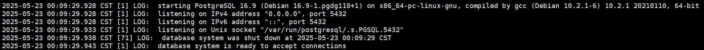
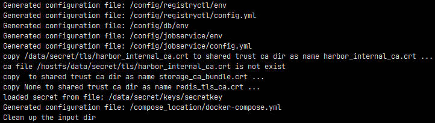

## 申明

操作系统版本：`CentOS Linux release 7.9.2009 (Core)`

```shell
cat /etc/centos-release
cat /etc/redhat-release
cat /etc/os-release
```

内核版本：`3.10.0-957.el7.x86_64`

```shell
uname -a
cat /proc/version
```

系统架构：`x86_64`

```shell
arch
```

docker 版本：`Docker version 26.1.4, build 5650f9b`

```shell
docker -v
```

docker-compose 版本：`Docker Compose version v2.36.1`

```shell
docker-compose -v
```

## 环境准备

### 系统磁盘空间检查

首先确认 docker 数据存储目录，查看磁盘空间是否充足可用

```shell
df -h
```


### docker 数据存储目录检查

查看 docker 数据存储目录，默认是：`/var/lib/docker`

```shel
docker info
```


对比存在磁盘不足，可以修改 docker 数据存储目录。

笔者以改为`/home/docker`为例：

**步骤1**：创建对应目录：

```shell
mkdir -p /home/docker
```

**步骤2**：注意 docker 旧的数据需要迁移过去：

```shell
cp -a /var/lib/docker /home/docker/
```

**步骤3**：再配置`daemon.json`的`data-root`：

```shell
vim /etc/docker/daemon.json
```

**步骤4**：填写`data-root`配置为指定数据存储目录：

```json
{
    "data-root": "/home/docker",
    "live-restore": true,
    
    "registry-mirrors": []
}
```

- 配置`docker live-restore`，这样再重启 dockerd 时，就不会重启容器。

**步骤5**：执行配置重载命令：

```shell
kill -SIGHUP $(pidof dockerd)
```

**步骤6**：执行配置重载命令：

```shell
systemctl daemon-reload
```

**步骤7**：再重启 docker：

```shell
systemctl restart docker
```

**步骤8**：再次执行docker info 查看是否修改正确：

```shell
docker info
```

### docker-compose 安装

**步骤1**：切换到指定目录：

```shell
cd /usr/local/bin/
```

**步骤2**：从 github 下载 docker-compose 可执行包：

```shell
wget https://github.com/docker/compose/releases/download/v2.36.1/docker-compose-linux-x86_64 -O docker-compose
```

**步骤3**：添加执行权限：

```shell
chmod +x /usr/local/bin/docker-compose
```

**步骤4**：在任意位置执行 docker-compose 命令输出版本信息，即安装成功：

```shell
docker-compose -v
```

## docker 安装 redis

**步骤1**：创建对应目录：

```shell
# 配置目录
mkdir -p /home/redis/conf
# 数据目录
mkdir -p /home/redis/data
```

**步骤2**：切换到 redis 配置文件目录：

```shell
cd /home/redis/conf
```

**步骤3**：下载配置文件

> https://redis.io/docs/latest/operate/oss_and_stack/management/config/ 下载对应版本的配置文件

```shell
wget https://raw.githubusercontent.com/redis/redis/7.4/redis.conf
```

**步骤4**：修改 redis.conf 配置文件：

```shell
vim /home/redis/conf/redis.conf
```

更新如下配置：

```conf
bind 0.0.0.0
requirepass redis@123
dir /data
```

**步骤5**：docker 拉取 redis 镜像：

```shell
docker pull redis:7.4
```

**步骤6**：启动 redis

```shell
docker run -d --name redis7.4 \
--restart=always \
-p 6379:6379 \
-e TZ=Asia/Shanghai \
-v /home/redis/conf/redis.conf:/usr/local/etc/redis/redis.conf \
-v /home/redis/data:/data \
redis:7.4 \
redis-server /usr/local/etc/redis/redis.conf
```

**步骤7**：查看容器日志检查是否启动成功：

```shell
docker logs -f redis7.4
```

可以看到：Ready to accept connections tcp 字样表示启动成功。


## docker 安装 postgreSQL

> 笔者安装的是带 postgis 版本的，方便后续地理坐标数据存储

**步骤1**：创建 postgreSQL 数据目录：

```shell
mkdir /home/postgresql/data
```

**步骤2**：拉取 postgis/postgis 镜像

```shell
docker pull postgis/postgis:16-3.5
```

**步骤3**：启动 postgreSQL 容器：

```shell
docker run -d --name postgresql16 \
--restart=always \
-p 5432:5432 \
-e TZ=Asia/Shanghai \
-e POSTGRES_USER=postgres \
-e POSTGRES_PASSWORD=postgres \
-v /home/postgresql/data:/var/lib/postgresql/data \
postgis/postgis:16-3.5
```

**步骤4**：查看容器日志检查是否启动成功：

```shell
docker logs -f postgresql16
```

可以看到：database system is ready to accept connections 字样表示启动成功。



也可以使用下述命令查询 postgreSQL 的版本信息：

```shell
docker exec postgresql16 psql -U postgres -c "SELECT version();"
```


## docker 安装 harbor

**步骤1**：创建 harbor 安装目录：

```shell
mkdir -p /home/harbor/data
mkdir -p /home/harbor/ssh
```

**步骤2**：切换到指定目录：

```shell
cd /home/harbor/
```

**步骤3**：使用 openssl 生成证书，依次执行下述命令

- 注意：如果不配置 https 或者有正式的 ssl 域名证书，则忽略本步骤。

```shell
# 生成 ca.key
openssl genrsa -out /services/harbor/ssh/ca.key 4096

# 根据 ca.key 签发 ca.crt 证书
openssl req -x509 -new -nodes -sha512 -days 3650 \
-subj "/C=CN/CN=localhost" \
-key /home/harbor/ssh/ca.key \
-out /home/harbor/ssh/ca.crt

# 生成 harbor.key
openssl genrsa -out /home/harbor/ssh/harbor.key 4096

# 根据 harbor.key 签名并生成 harbor.csr 证书
openssl req -sha512 -new \
    -subj "/C=CN/CN=localhost" \
    -key /home/harbor/ssh/harbor.key \
    -out /home/harbor/ssh/harbor.csr

# 根据 ca.key 和 ca.crt 证书 签名并认证 harbor.csr 证书
openssl x509 -req -sha512 -days 3650 \
-CA /home/harbor/ssh/ca.crt \
-CAkey /home/harbor/ssh/ca.key \
-CAcreateserial \
-in /home/harbor/ssh/harbor.csr \
-out /home/harbor/ssh/harbor.crt

# 将 harbor.crt 格式化成 harbor.cert
openssl x509 -inform PEM \
-in /home/harbor/ssh/harbor.crt \
-out /home/harbor/ssh/harbor.cert
```

**步骤4**：从 github 下载离线版本安装包：[harbor-offline-installer-v2.13.0.tgz](https://github.com/goharbor/harbor/releases/download/v2.13.0/harbor-offline-installer-v2.13.0.tgz)

```shell
wget https://github.com/goharbor/harbor/releases/download/v2.13.0/harbor-offline-installer-v2.13.0.tgz -O harbor-offline-installer-v2.13.0.tgz
```

**步骤5**：解压 tgz 文件：

```shell
tar xzvf /home/harbor/harbor-offline-installer-v2.13.0.tgz
```

**步骤6**：配置文件信息配置

解压成功之后，需要进入 harbor 文件夹，可以看到下述文件：


里面有个模板配置文件`harbor.yml.tmpl`，需要复制并重命名成`harbor.yml`：

```shell
cp /home/harbor/harbor/harbor.yml.tmpl /home/harbor/harbor/harbor.yml
```

将配置文件中的下述信息进行自定义配置：

```yml
hostname: 宿主机的IP

# http 端口默认为 80，改为1440，这个端口是宿主机映射到容器的 http 端口
http:
  port: 1440

# 注释 https 配置，不开启 https
#https:
  # https 端口默认为443，如果配置了，则这个端口是宿主机映射到容器的 https 端口
  # port: 443
  # ssl 证书
  # certificate: /your/certificate/path
  # ssl 证书私钥
  # private_key:  /your/private/key/path
  # strong_ssl_ciphers: false
  
# https 访问地址，这里配置，则 hostname 不生效
external_url: http://宿主机的IP:1440

# 默认密码
harbor_admin_password: Harbor12345

# 宿主机挂载 harbor 数据文件目录
data_volume: /home/harbor/data

# 使用外部 postgreSQL 数据库
external_database:
  harbor:
    host: 宿主机的IP
    port: 5432
    db_name: harbor_db
    username: postgres
    password: postgres
    # 不启用 SSL 模式
    ssl_mode: disable
    # 空闲连接池的最大连接数。如果 <=0，则不保留任何空闲连接。默认值为 2
    max_idle_conns: 2
    # 数据库的最大打开连接数。如果 <= 0，则打开连接数不受限制。默认值为 0
    max_open_conns: 0

# 使用外部 redis 数据库
external_redis:
  host: 宿主机IP:6379
  # 宿主机的redis密码，如果没有密码则不需要填写
  password: redis@123
```

上述配置中，如果配置了`https`，则`external_url`需要配置为：`https://` + 宿主机 IP 或者 域名 + `https.port`，浏览器访问时，证书信息如下：


**步骤7**：创建数据库

注意上述配置了数据库使用宿主机的 postgreSQL，因此需要在宿主机的 pgSQL 数据库中创建对应的数据库：

```shell
docker exec -it postgresql16 psql -U postgres -c "CREATE DATABASE harbor_db;"
```

**步骤8**：执行预处理程序：

```shell
/home/harbor/harbor/prepare
```

预处理脚本执行成功，则会出现 Generated configuration file: /compose_location/docker-compose.yml 字样。



此时当前文件夹下出现了`docker-compose.yml`文件，

**注意**：上述配置再次改动后，需要重新执行 prepare 脚本，重新生成 docker-compose.yml 文件。

- 重置数据库

```shell
docker exec -it postgresql16 psql -U postgres -c "DROP DATABASE IF EXISTS harbor_db;" -c "CREATE DATABASE harbor_db;"
```

出现 DROP DATABASE、CREATE DATABASE 字样，表示重新创建数据库成功。

- 删除历史数据

```shell
rm -rf /home/harbor/data/*
```

**步骤9**：启动 harbor 服务

```shell
sh /home/harbor/harbor/install.sh
```

执行完成，出现 Harbor has been installed and started successfully 字样表示启动成功


此时浏览器访问：`http://宿主机IP:1440`即可打开 harbor 控制台页面。此时浏览器可能出现证书不安全提示，强制访问即可。


账号为：admin，密码为：Harbor12345。登录成功页面如下，强烈建议及时修改管理员账号密码


**步骤9**：如果需要卸载 harbor 服务，则执行：

```shell
# 切换至 harbor 文件目录
cd /home/harbor/harbor
# 停止并删除所有harbor相关容器
docker-compose down -v
# 删除数据库，重新创建数据库
docker exec -it postgresql16 psql -U postgres -c "DROP DATABASE IF EXISTS harbor_db;" -c "CREATE DATABASE harbor_db;"
# 删除harbor数据存储目录
rm -rf /home/harbor/data/*
```


## harbor 控制台配置

### 修改主题色

左下角切换主题色


### 创建镜像仓库

在`系统管理`的`仓库管理`中创建新的仓库：


填写目标信息之后，点击确定，列表展示了仓库信息。


### 创建项目

点击`项目`菜单，创建新的项目


填写项目名称为`image`，并开启镜像代理：

- 注意：开启了镜像代理，则该项目不能向其推送镜像。访问级别是公开的则所有人可拉取该项目下的镜像。


上述配置好后，在已经搭建了 harbor 的服务器上，拉取测试镜像：

```shell
docker pull 127.0.0.1:1444/image/hello-world
```


此时登录 harbor 控制台可以看到已经拉取成功的镜像。

## 宿主机 nginx 配置

nginx 配置示例如下：

```conf
upstream harbor {
  # harbor 服务端口
  server 宿主机IP:1440;
}

server {
  # 暴露给公网的 https 端口
  listen 1444 ssl;
  server_tokens off;
  server_name _;
  # ssl 证书文件路径
  ssl_certificate /data/ssh/public.pem;
  # ssl 证书私钥文件路径
  ssl_certificate_key /data/ssh/private.key;
  ssl_session_timeout 5m;
  add_header Accept-Ranges bytes;
  ssl_protocols TLSv1 TLSv1.1 TLSv1.2 TLSv1.3;
  ssl_ciphers ECDHE-RSA-AES128-GCM-SHA256:HIGH:!aNULL:!MD5:!RC4:!DHE;
  ssl_prefer_server_ciphers on;

  client_max_body_size 0;

  location /v2/ {
    proxy_pass http://harbor/v2/;
    proxy_set_header Host $http_host;
    proxy_set_header X-Real-IP $remote_addr;
    proxy_set_header X-Forwarded-For $proxy_add_x_forwarded_for;
    proxy_set_header X-Forwarded-Proto $scheme;

    proxy_set_header Authorization $http_authorization;
    proxy_pass_header Authorization;
    client_max_body_size 0;
    proxy_request_buffering off;
    proxy_buffering off;
  }

  location ~^/(service|c|image)/ {
    proxy_pass http://harbor;
    proxy_set_header Host $host;
    proxy_set_header X-Real-IP $remote_addr;
    proxy_set_header X-Forwarded-For $proxy_add_x_forwarded_for;
    proxy_set_header X-Forwarded-Proto $scheme;
  }

  location / {
    # 只允许内网IP可以访问控制台，外网IP访问直接 403
    allow 10.0.0.0/8;
    allow 192.168.0.0/16;
    allow 172.16.0.0/16;
    allow 172.21.0.0/16;
    deny all;
    proxy_pass http://harbor;
    proxy_set_header Host $host;
    proxy_set_header X-Real-IP $remote_addr;
    proxy_set_header X-Forwarded-For $proxy_add_x_forwarded_for;
    proxy_set_header X-Forwarded-Proto $scheme;
  }

  error_page 403 /403.html;
  location = /403.html {
    root /usr/share/nginx/html;
    internal;
  }

  proxy_intercept_errors on;
  fastcgi_intercept_errors on;

  error_log /var/log/nginx/harbor_error.log error;
  access_log /var/log/nginx/harbor.log main;
}
```

注意上述配置自定义了`403.html`，需要在`/usr/share/nginx/html`目录中创建`403.html`：

```html
<!DOCTYPE html>
<html lang="en">
<head>
    <meta charset="UTF-8">
    <meta name="viewport" content="width=device-width, initial-scale=1.0">
    <title>403 Forbidden</title>
</head>
<body>
    <h1>403 Forbidden</h1>
    <p>You don't have permission to access this resource.</p>
</body>
</html>
```

