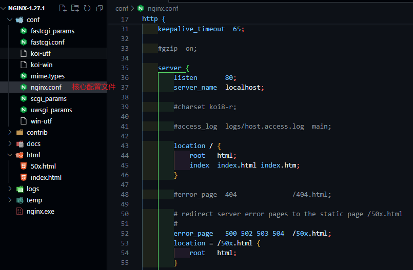
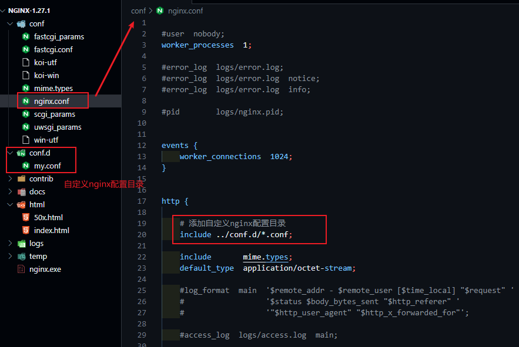
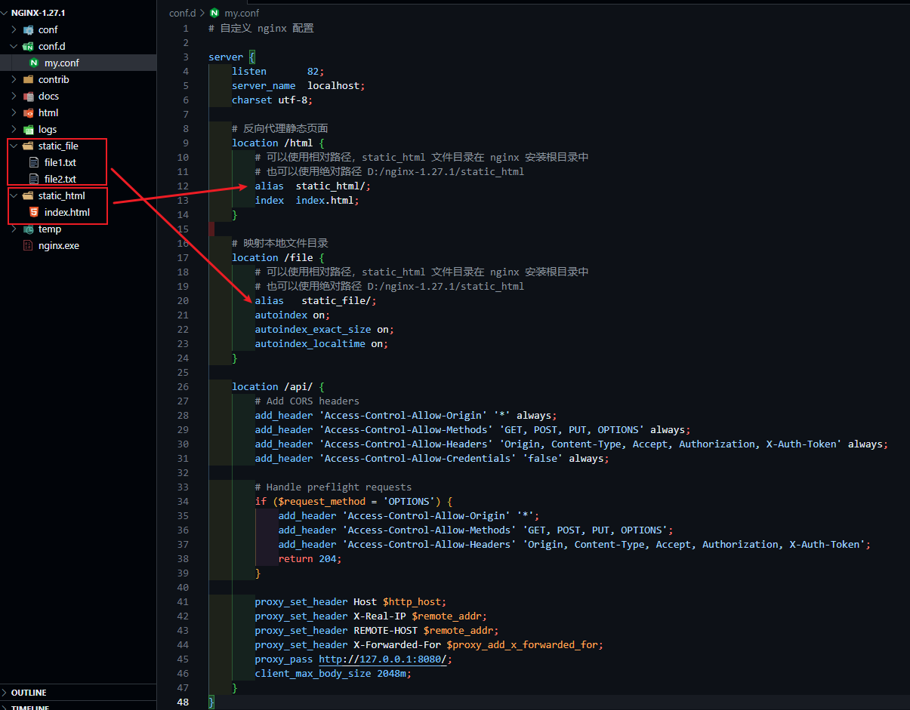

nginx 官网：https://nginx.org

安装包下载地址：https://nginx.org/en/download.html

## windows 平台

推荐下载 Mainline version，以 [nginx/Windows-1.27.1](https://nginx.org/download/nginx-1.27.1.zip) 为例：

### 目录结构

下图为 vsCode 打开 nginx-1.27.1 程序目录文件夹视图：



核心配置文件目录：conf 中存在核心配置文件：nginx.conf，默认配置如下（去除了注释）：

```conf
worker_processes  1;

events {
    worker_connections  1024;
}

http {
    include       mime.types;
    default_type  application/octet-stream;

    sendfile        on;

    keepalive_timeout  65;

    server {
        listen       80;
        server_name  localhost;

        location / {
            root   html;
            index  index.html index.htm;
        }

        error_page   500 502 503 504  /50x.html;
        location = /50x.html {
            root   html;
        }   
    }
}
```

上述配置，默认监听 80 端口，请求异常状态码为：500、502、503、504 时，均展示 html 文件目录中的 50x.html

### 自定义 nginx 配置



### 自定义反向代理



在 my.conf 配置文件中，配置如下：

```conf
# 自定义 nginx 配置

server {
    listen       82;
    server_name  localhost;
    charset utf-8;

    # 反向代理静态页面
	location /html {
        # 可以使用相对路径，static_html 文件目录在 nginx 安装根目录中
        # 也可以使用绝对路径 D:/nginx-1.27.1/static_html
		alias  static_html/;
		index  index.html;
	}
 
    # 映射本地文件目录
    location /file {
        # 可以使用相对路径，static_html 文件目录在 nginx 安装根目录中
        # 也可以使用绝对路径 D:/nginx-1.27.1/static_html
        alias   static_file/;
        autoindex on;
        autoindex_exact_size on;
        autoindex_localtime on;
    }

    location /api/ {
        # Add CORS headers
        add_header 'Access-Control-Allow-Origin' '*' always;
        add_header 'Access-Control-Allow-Methods' 'GET, POST, PUT, OPTIONS' always;
        add_header 'Access-Control-Allow-Headers' 'Origin, Content-Type, Accept, Authorization, X-Auth-Token' always;
        add_header 'Access-Control-Allow-Credentials' 'false' always;

        # Handle preflight requests
        if ($request_method = 'OPTIONS') {
            add_header 'Access-Control-Allow-Origin' '*';
            add_header 'Access-Control-Allow-Methods' 'GET, POST, PUT, OPTIONS';
            add_header 'Access-Control-Allow-Headers' 'Origin, Content-Type, Accept, Authorization, X-Auth-Token';
            return 204;
        }        

		proxy_set_header Host $http_host;
		proxy_set_header X-Real-IP $remote_addr;
		proxy_set_header REMOTE-HOST $remote_addr;
		proxy_set_header X-Forwarded-For $proxy_add_x_forwarded_for;
		proxy_pass http://127.0.0.1:8080/;
        client_max_body_size 2048m;
    }
}
```

## linux 平台

