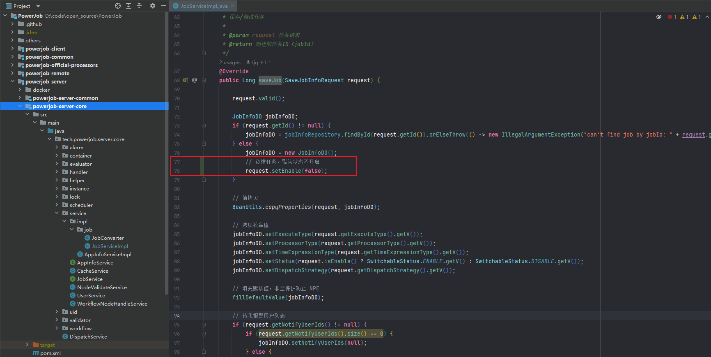

## 下载 powerjob

powerjob 官网：http://www.powerjob.tech/

github 仓库：

```shell
git clone https://github.com/PowerJob/PowerJob.git
```

gitee 仓库：

```shell
git clone https://gitee.com/KFCFans/PowerJob
```

注意：拉取 tag 为 v4.3.6 的工程代码

## IDEA 环境配置

配置1


配置2


## maven 构建跳过单元测试

在父工程的 pom.xml 配置文件中增加跳过单元测试插件：

```xml
<plugin>
    <groupId>org.apache.maven.plugins</groupId>
    <artifactId>maven-surefire-plugin</artifactId>
    <configuration>
        <skip>true</skip>
    </configuration>
</plugin>
```

## 修改系统配置

在  powerjob-server/powerjob-server-starter 工程中修改`application-daily.properties`配置文件，修改数据库链接信息：

```properties
# 修改 数据库链接
spring.datasource.core.jdbc-url

# 修改 数据库链接
oms.storage.dfs.mysql_series.url

# 关闭 mongodb
oms.mongodb.enable=false
```

## 设置创建任务默认不启动

在 powerjob-server/powerjob-server-core 工程中找到方法：tech.powerjob.server.core.service.impl.job.JobServiceImpl#saveJob

```java
@Override
public Long saveJob(SaveJobInfoRequest request) {

    request.valid();

    JobInfoDO jobInfoDO;
    if (request.getId() != null) {
        jobInfoDO = jobInfoRepository.findById(request.getId()).orElseThrow(() -> new IllegalArgumentException("can't find job by jobId: " + request.getId()));
    } else {
        jobInfoDO = new JobInfoDO();
        // 创建任务，默认状态不开启
        request.setEnable(false);
    }
}
```

在任务创建时设置任务状态为：停止



## 打包 powerjob-server 

在 powerjob 工程根目录编译打包，打包成功的 jar 包在 powerjob-server/powerjob-server-starter/target 目录中，名为：powerjob-server-starter-4.3.6.jar


## 运行 powerjob server

使用 java 命令运行 powerjob server：

```shell
java -jar powerjob-server-starter-4.3.6.jar
```

powerjob server 启动成功后，浏览器访问：http://127.0.0.1:7700 即可


## springboot 项目引入 powerjob client

步骤0：在 powerjob server 中注册应用名称及密码：

本文演示代码，注册应用名称为：powerjob_client_dev，密码：powerjob_client_dev

步骤1：在 springboot 项目中引入 powerjob client 依赖：

```xml
<dependency>
    <groupId>tech.powerjob</groupId>
    <artifactId>powerjob-worker-spring-boot-starter</artifactId>
    <version>4.3.6</version>
</dependency>
```

步骤2：配置 powerjob 客户端配置：

```yaml
powerjob:
  worker:
    app-name: powerjob_client_dev
    server-address: 127.0.0.1:7700
    protocol: http
```

步骤3：编写 BasicProcessor 接口实现类

```java
import lombok.extern.slf4j.Slf4j;
import org.springframework.stereotype.Component;
import tech.powerjob.worker.core.processor.ProcessResult;
import tech.powerjob.worker.core.processor.TaskContext;
import tech.powerjob.worker.core.processor.sdk.BasicProcessor;
import tech.powerjob.worker.log.OmsLogger;

import java.util.Optional;

@Slf4j
@Component
public class TestJobProcessor implements BasicProcessor {

    @Override
    public ProcessResult process(TaskContext context) throws Exception {
        OmsLogger logger = context.getOmsLogger();
        log.info("test job, start");
        logger.info("test job, start");
        try {
            String jobParams = Optional.ofNullable(context.getJobParams()).orElse("");

            log.info("test job, context:{}", context.getWorkflowContext());
            log.info("test job, params:{}", jobParams);
            logger.info("test job, context:{}", context.getWorkflowContext());
            logger.info("test job, params:{}", jobParams);
        } finally {

        }
        log.info("test job, end");
        logger.info("test job, end");
        return new ProcessResult(true, "test job done");
    }
}
```

步骤4：启动 springboot 服务

步骤5：使用步骤0 注册的应用名登录 powerjob server，新建相应定时任务即可
