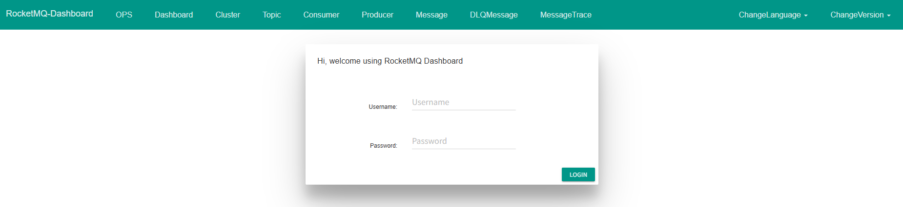

官网：https://rocketmq.apache.org/

5.x 文档：https://rocketmq.apache.org/zh/docs/

4.x 文档：https://rocketmq.apache.org/zh/docs/4.x/

## 端口号说明

| 涉及服务   | 端口号 | 说明                                                         | 修改方式                                      |
| ---------- | ------ | ------------------------------------------------------------ | --------------------------------------------- |
| Broker     | 10909  | Broker VIPChannel 所用到的端口，默认计算方式为`listenPort - 2`（因此通常是10909） |                                               |
| Broker     | 10911  | Broker 默认使用的监听端口(`listenPort`)                      |                                               |
| Broker     | 10912  | 主从Broker 数据同步端口（`haListenPort`）                    |                                               |
| Proxy      | 8081   | gRPC协议访问端口(`grpcServerPort`)                           | rmq-proxy.json 配置中配置：grpcServerPort     |
| Proxy      | 8080   | remoting 协议访问端口（`remotingListenPort`）                | rmq-proxy.json 配置中配置：remotingListenPort |
| NameServer | 9786   | NameServer 的端口，客户端通过该端口与 NameServer 进行通信，获取 Broker 信息和路由表等 |                                               |
| Dashboard  | 8080   | 控制台访问端口                                               |                                               |

## 工作目录准备

按照图示准备目录及配置文件
```ini
.
├── broker
│   ├── conf
│   │   ├── broker.conf
│   │   └── tools.yml
│   ├── logs
│   └── store
├── dashboard
│   └── conf
│       └── users.properties
├── docker-compose.yaml
└── proxy
    └── conf
        └── rmq-proxy.json
```

步骤1：创建 rockermq 文件目录：

```shell
mkdir -p /home/rocketmq5.3.3/broker/{logs,store,conf}
mkdir -p /home/rocketmq5.3.3/proxy/{logs,conf}
mkdir -p /home/rocketmq5.3.3/dashboard/conf
```

步骤2：创建 broker 必要的配置文件：

```shell
touch /home/rocketmq5.3.3/broker/conf/broker.conf
touch /home/rocketmq5.3.3/broker/conf/tools.yml
```

步骤3：创建 proxy 必要的配置文件：

```shell
touch /home/rocketmq5.3.3/proxy/conf/rmq-proxy.json
```

步骤4：创建 dashboard 必要的配置文件：

```shell
touch /home/rocketmq5.3.3/dashboard/conf/users.properties
```

步骤5：创建 docker-compose 文件：

```shell
touch /home/rocketmq5.3.3/docker-compose.yaml
```

步骤6：授权读写权限：

```shell
chown -R 3000:3000 /home/rocketmq5.3.3/
```

## broker 配置

### broker.conf 配置

编辑 broker.conf 配置文件：

```shell
vim /home/rocketmq5.3.3/broker/conf/broker.conf
```

写入配置：

```properties
brokerClusterNamex=DefaultCluster
brokerName=broker-a
brokerId=0
deleteWhen=04
fileReservedTime=48
brokerRole=ASYNC_MASTER
flushDiskType=ASYNC_FLUSH
# broker 暴露的IP地址
brokerIP1=192.168.100.1
# 开启认证功能
authenticationEnabled=true
authenticationProvider=org.apache.rocketmq.auth.authentication.provider.DefaultAuthenticationProvider
initAuthenticationUser={"username":"woodwhales","password":"woodwhales"}
innerClientAuthenticationCredentials={"accessKey":"woodwhales","secretKey":"woodwhales"}
authenticationMetadataProvider=org.apache.rocketmq.auth.authentication.provider.LocalAuthenticationMetadataProvider
# 开启授权功能
authorizationEnabled=true
authorizationProvider=org.apache.rocketmq.auth.authorization.provider.DefaultAuthorizationProvider
authorizationMetadataProvider=org.apache.rocketmq.auth.authorization.provider.LocalAuthorizationMetadataProvider
# 兼容 ACL 1.0 的 plain_acl.yml 文件
migrateAuthFromV1Enabled=true
```

注意：`initAuthenticationUser`和`innerClientAuthenticationCredentials`改为自己要定义的账号密码。

### tools.yml 配置

编辑 broker.conf 配置文件：

```shell
vim /home/rocketmq5.3.3/broker/conf/tools.yml
```

写入配置：

```yaml
accessKey: woodwhales
secretKey: woodwhales
```

注意：`accessKey`和`secretKey`要和 broker.conf 配置文件中的`innerClientAuthenticationCredentials`配置内容一致。

## proxy 配置

### rmq-proxy.json 配置

编辑 rmq-proxy.json 配置文件：

```shell
vim /home/rocketmq5.3.3/proxy/conf/rmq-proxy.json
```

写入配置：

```yaml
{
    "rocketMQClusterName": "DefaultCluster",
    "remotingListenPort": 18680,
    "grpcServerPort": 18681,
    "enableACL": true,
    "authenticationEnabled": true,
    "authenticationProvider": "org.apache.rocketmq.auth.authentication.provider.DefaultAuthenticationProvider",
    "authenticationMetadataProvider": "org.apache.rocketmq.proxy.auth.ProxyAuthenticationMetadataProvider",
    "innerClientAuthenticationCredentials": "{\"accessKey\":\"woodwhales\", \"secretKey\":\"woodwhales\"}",
    "enableAclRpcHookForClusterMode": true,
    "authorizationEnabled": true,
    "authorizationProvider": "org.apache.rocketmq.auth.authorization.provider.DefaultAuthorizationProvider",
    "authorizationMetadataProvider": "org.apache.rocketmq.proxy.auth.ProxyAuthorizationMetadataProvider",
    "migrateAuthFromV1Enabled": true
}
```

配置说明：

- `remotingListenPort`默认为：8080，笔者改为了 18680
- `grpcServerPort`默认为：8081，笔者改为了 18681
- `enableACL`设置为：true，开启 ACL 功能
- `innerClientAuthenticationCredentials`配置和 broker.conf 配置中的`innerClientAuthenticationCredentials` 保持一致
- `enableAclRpcHookForClusterMode`设置为：true
- `authorizationEnabled`设置为：true

## dashboard 配置

### users.properties 配置

编辑 users.properties 配置文件：

```shell
vim /home/rocketmq5.3.3/dashboard/conf/users.properties
```

写入配置：

```properties
# 配置 dashboard 登录账号密码
admin=woodwhales,1
```

## docker-compose 完整配置

```yaml
services:
  namesrv:
    image: apache/rocketmq:5.3.3
    container_name: rmqnamesrv
    ports:
      - 9876:9876
    networks:
      - rocketmq
    restart: always
    environment:
      - TZ=Asia/Shanghai
    command: sh mqnamesrv
  broker:
    image: apache/rocketmq:5.3.3
    container_name: rmqbroker
    ports:
      - 10909:10909
      - 10911:10911
      - 10912:10912
    restart: always
    environment:
      - TZ=Asia/Shanghai
      - NAMESRV_ADDR=rmqnamesrv:9876
    volumes:
      - /home/rocketmq5.3.3/broker/conf/broker.conf:/home/rocketmq/rocketmq-5.3.3/conf/broker.conf
      - /home/rocketmq5.3.3/broker/conf/tools.yml:/home/rocketmq/rocketmq-5.3.3/conf/tools.yml
      - /home/rocketmq5.3.3/broker/logs/:/home/rocketmq/logs/rocketmqlogs/
      - /home/rocketmq5.3.3/broker/store:/home/rocketmq/store
    depends_on:
      - namesrv
    networks:
      - rocketmq
    command: sh mqbroker -c /home/rocketmq/rocketmq-5.3.3/conf/broker.conf 
  proxy:
    image: apache/rocketmq:5.3.3
    container_name: rmqproxy
    networks:
      - rocketmq
    depends_on:
      - broker
      - namesrv
    ports:
      - 18680:18680
      - 18681:18681
    restart: on-failure
    volumes:
      - /home/rocketmq5.3.3/proxy/conf/rmq-proxy.json:/home/rocketmq/rocketmq-5.3.3/conf/rmq-proxy.json
      - /home/rocketmq5.3.3/broker/conf/tools.yml:/home/rocketmq/rocketmq-5.3.3/conf/tools.yml
      - /home/rocketmq5.3.3/proxy/logs/:/home/rocketmq/logs/rocketmqlogs
    environment:
      - NAMESRV_ADDR=rmqnamesrv:9876
    command: sh mqproxy -pc /home/rocketmq/rocketmq-5.3.3/conf/rmq-proxy.json
  dashboard:
    image: apacherocketmq/rocketmq-dashboard:2.0.1
    container_name: rmqdashboard
    networks:
      - rocketmq
    ports:
      - 8682:8080
    volumes:
      - /home/rocketmq5.3.3/dashboard/conf/users.properties:/tmp/rocketmq-console/data/users.properties
    environment:
      - TZ=Asia/Shanghai
      - JAVA_OPTS=-Drocketmq.config.namesrvAddrs=rmqnamesrv:9876 -Drocketmq.config.proxyAddrs=rmqproxy:18680 -Drocketmq.config.accessKey=woodwhales -Drocketmq.config.secretKey=woodwhales -Drocketmq.config.loginRequired=true
    restart: always
    depends_on:
      - broker
      - namesrv 
networks:
  rocketmq:
    driver: bridge
```

一键启动

```shell
docker-compose up -d
```

一键停止所有容器

```shell
docker-compose stop
```

一键查看所有启动的容器

```shell
docker-compose ps
```

一键删除所有容器

```shell
docker-compose down
```

## 服务启动成功状态校验

### NameServer 启动成功校验

```shell
docker logs -f rmqnamesrv
```

出现如下字样标识启动成功：

```ini
The Name Server boot success. serializeType=JSON, address 0.0.0.0:9876
```

### Broker 启动成功校验

```shell
docker logs -f rmqbroker
```

出现如下字样标识启动成功：

```ini
The broker[broker-a, 192.168.100.1:10911] boot success. serializeType=JSON and name server is rmqnamesrv:9876
```

### Proxy 启动成功校验

```shell
docker logs -f rmqproxy
```

出现如下字样标识启动成功：

```ini
rocketmq-proxy startup successfully
```

### Dashboard 启动成功校验

```shell
docker logs -f rmqdashboard
```

出现如下字样标识启动成功：

```ini
INFO main - Starting ProtocolHandler ["http-nio-8080"]
INFO main - Tomcat started on port(s): 8080 (http) with context path ''
INFO main - Started App in 3.74 seconds
```

浏览器访问：http://192.168.100.1:8682/



账号密码为`/home/rocketmq5.3.3/dashboard/conf/users.properties`配置文件中的配置。

注意：Acl 菜单在 rocketmq 5.x 版本不可用，需要使用命令形式操作，具体参见下文。

## ACL 2.0 特性

### 核心概念

基于角色的访问控制（RBAC）和基于属性的访问控制（ABAC）是访问控制体系中两种主要的方法。RocketMQ ACL 2.0 融合了两者。

RBAC 是基于角色的访问控制模型，通过角色进行权限的分配。

RocketMQ ACL 2.0 将用户角色划分为`超级用户（Super）`和`普通用户（Normal）`

- **超级用户**：具有最高级别的权限，能够无需授权即可访问资源，这简化了集群初始化及日常运维过程中的权限依赖问题。
- **普通用户**：在访问资源之前，需要被赋予相应的权限，适用于业务场景中，对资源进行按需访问。

#### 认证（Authentication）

认证作为一种安全机制，旨在验证发起访问请求者的身份真实性。它用于确保只有那些经过身份验证的合法用户或实体才能访问受保护的资源或执行特定的操作。简而言之，认证就是在资源或服务被访问之前回答“你是谁？”这个问题。

RocketMQ ACL 2.0 版本维持了与 ACL 1.0 相同的认证机制，即基于 AK/SK 的认证方式。这种方式主要通过对称加密技术来核验客户端的身份，保证敏感的认证信息（如密码）不会在网络上明文传输，从而提升了整体的认证安全性。

##### 认证流程


客户端流程：

1. 客户端在构建 RPC 请求时，检查是否设置了用户名和密码，若未配置，则直接发送请求；
2. 若已配置，则使用预设的加密算法对请求参数进行加密处理，并生成对应的数字签名（Signature）。
3. 在请求中附加用户名和 Signature，并将其发送至服务端以进行身份验证。

服务端流程：

1. 服务端接收到请求后，首先检查是否开启认证，若未开启，则不校验直接通过；若已开启了，则进入下一步。
2. 服务端对请求进行认证相关的参数进行解析和组装，获取包括用户名和 Signature 等信息。
3. 通过用户名在本地库中查询用户相关信息，用户不存在，则返回处理无；用户存在，则进入下一步。
4. 获取用户密码，采用相同的加密算法对请求进行加密生成 Signature，并和客户端传递的 Signature 进行比对，若两者一致，则认证成功，不一致，则认证失败。

#### 授权（Authorization）

##### 核心概念

授权作为一种安全机制，旨在确定访问请求者是否拥有对特定资源进行操作的权限。简而言之，授权就是在资源被访问之前回答“谁在何种环境下对哪些资源执行何种操作”这个问题。

基于“属性的访问控制（ABAC）”模型，RocketMQ ACL 2.0 涵盖了以下一系列的核心概念。在系统实现中，都会以以下概念作为指导，完成整个权限管理和授权机制的设计和实现。


##### 授权流程


客户端流程：

1. 客户端在构建 RPC 请求时，构建本次调用的接口入参，接口对应权限背后的操作定义。
2. 客户端在接口入参中设置本次访问的资源信息，然后将用户和资源等参数传递到服务端。

服务端流程：

1. 服务端在收到请求后，首先检查是否开启授权，若未开启，则不校验直接通过；若已开启了，则进入下一步。
2. 服务端对请求中和授权相关的参数进行解析和组装，这些数据包括用户信息、访问的资源、执行的操作，以及请求的环境等。
3. 通过用户名在本地数据存储中查询用户相关信息，若用户不存在，则返回错误；若用户存在，则进入下一步。
4. 判断当前用户是否是超级用户，若超级用户，则直接通过请求，无需做授权检查，若普通用户，则进入下一步进行详细的授权检查。
5. 根据用户名获取相关的授权策略列表，并对本次请求的资源、操作，以及环境进行匹配，同时按照优先级进行排序。
6. 根据优先级最高的授权策略做出决策，若授权策略允许该操作，则返回授权成功，若拒绝该操作，则返回无权限错误。

## topic 管理

### 通过控制台手动创建 topic

通过控制台手动创建 topic


创建名为：topic_a 的普通消息主题


刷新主题列表，可以看到创建成功的 topic


### 通过命令创建 topic

先进入 broker 容器：

```shell
docker exec rmqbroker sh mqadmin updateTopic -n rmqnamesrv:9876 -t topic_b -c DefaultCluster -a +message.type=NORMAL
```

> `message.type`可以为：UNSPECIFIED, TRANSACTION, FIFO, MIXED, DELAY, NORMAL

出现如下字样标示操作成功：

```ini
create topic to 127.0.0.1:10911 success.
TopicConfig [topicName=topic_b, readQueueNums=8, writeQueueNums=8, perm=RW-, topicFilterType=SINGLE_TAG, topicSysFlag=0, order=false, attributes={+message.type=NORMAL}]
```

另外通过控制台也可以看到创建成功的 topic。

## 用户管理

### 查询用户列表

#### 指令

listUser

#### 参数说明

- `-b`或者`--brokerAddr`，broker 地址（与`-c`参数二选一即可）
- `-c`或者 `--clusterName`，broker 集群名称（与`-b`参数二选一即可）
- `-n`或者`--namesrvAddr`，nameserver 地址，多个地址使用英文逗号分隔
- `-h`或者 `--help`，帮助文档
-  `-f`或者`--filter`，过滤条件（支持用户名称模糊查询，可选）

#### 示例

```shell
docker exec rmqbroker sh mqadmin listUser -n rmqnamesrv:9876 -c DefaultCluster
```

出现用户信息表示查询成功：

```ini
#UserName         #Password               #UserType               #UserStatus           
woodwhales        woodwhales              Super                   enable                
get user from 127.0.0.1:10911 success.
```

### 创建用户 

#### 指令

createUser

#### 参数说明

- `-b`或者`--brokerAddr`，broker 地址（与`-c`参数二选一即可）
- `-c`或者 `--clusterName`，broker 集群名称（与`-b`参数二选一即可）
- `-h`或者 `--help`，帮助文档
- `-n`或者`--namesrvAddr`，nameserver 地址，多个地址使用英文逗号分隔
- `-p`或者`--password`，用户密码
-  `-t`或者`--userType`，用户类型，可选：`Super`、`Normal`
- `-u`或者`--username`，用户名称

#### 示例

```shell
docker exec rmqbroker sh mqadmin createUser -n rmqnamesrv:9876 -c DefaultCluster -u rocketmq_a -p rocketmq_a
```

出现如下字样标示操作成功：

```ini
create user to 127.0.0.1:10911 success.
```

### 更新用户

#### 指令

updateUser

#### 参数说明

- `-b`或者`--brokerAddr`，broker 地址（与`-c`参数二选一即可）
- `-c`或者 `--clusterName`，broker 集群名称（与`-b`参数二选一即可）
- `-h`或者 `--help`，帮助文档
- `-n`或者`--namesrvAddr`，nameserver 地址，多个地址使用英文逗号分隔
- `-p`或者`--password`，用户密码
- `-s`或者`--userStatus`，用户状态，可选：`enable`、`disable`（只能单独执行，不可以和 `-t`、`-p`一起执行）
-  `-t`或者`--userType`，用户类型，可选：`Super`、`Normal`
- `-u`或者`--username`，用户名称

#### 示例

```shell
docker exec rmqbroker sh mqadmin updateUser -n rmqnamesrv:9876 -c DefaultCluster -u rocketmq_a -p rocketmq_a
```

### 查看用户详情

#### 指令

getUser

#### 参数说明

- `-b`或者`--brokerAddr`，broker 地址（与`-c`参数二选一即可）
- `-c`或者 `--clusterName`，broker 集群名称（与`-b`参数二选一即可）
- `-h`或者 `--help`，帮助文档
- `-n`或者`--namesrvAddr`，nameserver 地址，多个地址使用英文逗号分隔
- `-n`或者`--username`，用户名称

#### 示例

查看 rocketmq_a 用户详情

```shell
docker exec rmqbroker sh mqadmin getUser -n rmqnamesrv:9876 -c DefaultCluster -u rocketmq_a
```

### 删除用户

#### 指令

deleteUser

#### 参数说明

- `-b`或者`--brokerAddr`，broker 地址（与`-c`参数二选一即可）
- `-c`或者 `--clusterName`，broker 集群名称（与`-b`参数二选一即可）
- `-h`或者 `--help`，帮助文档
- `-n`或者`--namesrvAddr`，nameserver 地址，多个地址使用英文逗号分隔
- `-n`或者`--username`，用户名称

#### 示例

删除 rocketmq_a 用户

```shell
docker exec rmqbroker sh mqadmin deleteUser -n rmqnamesrv:9876 -c DefaultCluster -u rocketmq_a
```

## ACL 管理

### 查询授权列表

#### 命令

listAcl

#### 参数说明

- `-b`或者`--brokerAddr`，broker 地址（与`-c`参数二选一即可）
- `-c`或者 `--clusterName`，broker 集群名称（与`-b`参数二选一即可）
- `-h`或者 `--help`，帮助文档
- `-n`或者`--namesrvAddr`，nameserver 地址，多个地址使用英文逗号分隔
- `-r`或者`--resource`，资源过滤条件
- `-s`或者`--subject`，授权用户过滤条件（支持模糊查询）

#### 示例

查询授权列表

```shell
docker exec rmqbroker sh mqadmin listAcl -n rmqnamesrv:9876 -c DefaultCluster
```

查询 rocketmq_a 用户授权列表

```shell
docker exec rmqbroker sh mqadmin listAcl -n rmqnamesrv:9876 -c DefaultCluster -s User:rocketmq_a
```

查询 topic 为 topic_a 授权情况

```shell
docker exec rmqbroker sh mqadmin listAcl -n rmqnamesrv:9876 -c DefaultCluster --resource Topic:topic_a
```

### 查询授权详情

#### 命令

getAcl

#### 参数说明

- `-b`或者`--brokerAddr`，broker 地址（与`-c`参数二选一即可）
- `-c`或者 `--clusterName`，broker 集群名称（与`-b`参数二选一即可）
- `-h`或者 `--help`，帮助文档
- `-n`或者`--namesrvAddr`，nameserver 地址，多个地址使用英文逗号分隔
- `-s`或者`--subject`，授权用户过滤条件（支持模糊查询）

#### 示例

查看 rocketmq_a 用户授权列表

```shell
docker exec rmqbroker sh mqadmin getAcl -n rmqnamesrv:9876 -c DefaultCluster -s User:rocketmq_a
```

### 创建授权

#### 命令

createAcl

#### 参数说明

- `-a`或者`--actions`，可选：`Pub`、`Sub`

- `-b`或者`--brokerAddr`，broker 地址（与`-c`参数二选一即可）
- `-c`或者 `--clusterName`，broker 集群名称（与`-b`参数二选一即可）
- `-d`或者`--decision`，决策类型，可选：`Allow`、`Deny`
- `-h`或者 `--help`，帮助文档
- `-i`或者`--sourceIp`，IP 白名单
- `-n`或者`--namesrvAddr`，nameserver 地址，多个地址使用英文逗号分隔
- `-r`或者`--resources`，资源
- `-s`或者`--subject`，授权用户

#### 示例

```shell
docker exec rmqbroker sh mqadmin createAcl -n rmqnamesrv:9876 -c DefaultCluster -s User:rocketmq_a -r Topic:topic_a,Group:* -a Sub -i '172.16.0.0/12,192.168.0.0/16' -d Allow

docker exec rmqbroker sh mqadmin createAcl -n rmqnamesrv:9876 -c DefaultCluster -s  User:rocketmq_b -r Topic:topic_b,Group:* -a Sub -i '172.16.0.0/12,192.168.0.0/16' -d ALLOW
```

上述IP白名单中`172.16.0.0/12`表示：`172.16.0.0 ~ 172.31.255.255`

 `192.168.0.0/16`表示：`192.168.0.0 ~ 192.168.255.255`

### 更新授权

#### 命令

updateAcl

#### 参数说明

- `-a`或者`--actions`，可选：`Pub`、`Sub`

- `-b`或者`--brokerAddr`，broker 地址（与`-c`参数二选一即可）
- `-c`或者 `--clusterName`，broker 集群名称（与`-b`参数二选一即可）
- `-d`或者`--decision`，决策类型，可选：`Allow`、`Deny`
- `-h`或者 `--help`，帮助文档
- `-i`或者`--sourceIp`，IP 白名单
- `-n`或者`--namesrvAddr`，nameserver 地址，多个地址使用英文逗号分隔
- `-r`或者`--resources`，资源
- `-s`或者`--subject`，授权用户

#### 示例

```
docker exec rmqbroker sh mqadmin updateAcl -n rmqnamesrv:9876 -c DefaultCluster -s User:rocketmq_a -r Topic:*,Group:* -a Sub -i 192.168.1.0/24 -d Deny
```

### 删除授权

#### 命令

deleteAcl

#### 参数说明

- `-b`或者`--brokerAddr`，broker 地址（与`-c`参数二选一即可）
- `-c`或者 `--clusterName`，broker 集群名称（与`-b`参数二选一即可）
- `-h`或者 `--help`，帮助文档
- `-n`或者`--namesrvAddr`，nameserver 地址，多个地址使用英文逗号分隔
- `-r`或者`--resources`，资源
- `-s`或者`--subject`，授权用户

#### 示例

删除 rocketmq_a 用户所有权限

```shell
docker exec rmqbroker sh mqadmin deleteAcl -n rmqnamesrv:9876 -c DefaultCluster -s User:rocketmq_a
```

 删除 rocketmq_a 用户指定 topic 权限

```shell
docker exec rmqbroker sh mqadmin deleteAcl -n rmqnamesrv:9876 -c DefaultCluster -s User:rocketmq_a -r Topic:topic_a
```

 删除 rocketmq_a 用户所有 topic 权限

```shell
docker exec rmqbroker sh mqadmin deleteAcl -n rmqnamesrv:9876 -c DefaultCluster -s User:rocketmq_a -r Topic:*
```

## Java SDK 示例

maven 工程引入：

```xml
<dependency>
    <groupId>org.apache.rocketmq</groupId>
    <artifactId>rocketmq-spring-boot-starter</artifactId>
    <version>2.3.3</version>
</dependency>
```

gradle 工程引入：

```groovy
implementation("org.apache.rocketmq:rocketmq-spring-boot-starter:2.3.4")
```

yaml 配置文件
```yaml
rocketmq:
  name-server: 192.168.100.1:9876
  producer:
    group: producer_group
    access-key: woodwhales
    secret-key: woodwhales
```

### 生产消息

使用`RocketMQTemplate`自动注入的 bean 生产消息

```java
import com.alibaba.fastjson2.JSON;
import lombok.extern.slf4j.Slf4j;
import org.apache.rocketmq.client.producer.SendResult;
import org.apache.rocketmq.spring.core.RocketMQTemplate;
import org.springframework.beans.factory.annotation.Autowired;
import org.springframework.web.bind.annotation.GetMapping;
import org.springframework.web.bind.annotation.RestController;

import java.util.HashMap;
import java.util.Map;
import java.util.UUID;

/**
 * @author woodwhales on 2025-07-24 22:48
 */
@Slf4j
@RestController
public class Producer1 {

    @Autowired
    private RocketMQTemplate rocketMQTemplate;

    private static final String topic_a = "topic_a";

    @GetMapping("/send1")
    public Object send() {
        Map<String, Object> body = new HashMap<>();
        body.put("uuid", UUID.randomUUID().toString());
        try {
            SendResult sendResult = rocketMQTemplate.syncSend(topic_a, JSON.toJSONString(body));
            log.info("send msg success, topic={}, sendResult={}", topic_a, sendResult);
            return "ok";
        } catch (Exception e) {
            log.error("send msg error, topic={}, errorMsg={}", topic_a, e.getMessage(), e);
            return "ko";
        }
    }

}
```

### 消费消息方式1

使用`@RocketMQMessageListener`注解消费消息

```java
import lombok.extern.slf4j.Slf4j;
import org.apache.rocketmq.common.message.MessageExt;
import org.apache.rocketmq.spring.annotation.RocketMQMessageListener;
import org.apache.rocketmq.spring.core.RocketMQListener;
import org.springframework.stereotype.Component;

import java.nio.charset.Charset;

/**
 * @author woodwhales on 2025-07-24 22:52
 */
@Slf4j
@Component
@RocketMQMessageListener(
        nameServer = "${rocketmq.name-server}",
        consumerGroup = "topic_a_group",
        topic = "topic_a",
        accessKey = "rocketmq_a",
        secretKey = "rocketmq_a")
public class Consumer1 implements RocketMQListener<MessageExt> {

    @Override
    public void onMessage(MessageExt message) {
        String body = new String(message.getBody());
        log.info("accept mq, topic={}, msg={}, message={}", message.getTopic(), body, message);
    }
}
```

### 消费消息方式2

自定义注册消费 bean

```java
import lombok.extern.slf4j.Slf4j;
import org.apache.rocketmq.acl.common.AclClientRPCHook;
import org.apache.rocketmq.acl.common.SessionCredentials;
import org.apache.rocketmq.client.consumer.DefaultLitePullConsumer;
import org.apache.rocketmq.client.consumer.DefaultMQPushConsumer;
import org.apache.rocketmq.client.consumer.MQPushConsumer;
import org.apache.rocketmq.client.consumer.listener.ConsumeConcurrentlyContext;
import org.apache.rocketmq.client.consumer.listener.ConsumeConcurrentlyStatus;
import org.apache.rocketmq.client.consumer.listener.MessageListenerConcurrently;
import org.apache.rocketmq.client.consumer.rebalance.AllocateMessageQueueAveragely;
import org.apache.rocketmq.client.exception.MQClientException;
import org.apache.rocketmq.client.producer.DefaultMQProducer;
import org.apache.rocketmq.common.consumer.ConsumeFromWhere;
import org.apache.rocketmq.common.message.MessageExt;
import org.apache.rocketmq.remoting.RPCHook;
import org.apache.rocketmq.spring.core.RocketMQTemplate;
import org.springframework.beans.factory.annotation.Autowired;
import org.springframework.beans.factory.annotation.Value;
import org.springframework.context.annotation.Bean;
import org.springframework.stereotype.Component;

import java.util.List;

/**
 * @author woodwhales on 2025-07-24 22:59
 */
@Slf4j
@Component
public class Consumer2 {

    @Value("${rocketmq.name-server}")
    private String namesrvAddr;

    @Autowired
    private Consumer2MessageListener consumer2MessageListener;

    private RPCHook rpcHook = new AclClientRPCHook(new SessionCredentials("rocketmq_b", "rocketmq_b"));

    @Bean(value = "pushConsumer", initMethod = "start", destroyMethod = "shutdown")
    public MQPushConsumer pushConsumer() throws Exception {
        DefaultMQPushConsumer consumer = new DefaultMQPushConsumer(rpcHook);
        consumer.setConsumerGroup("topic_b_group");
        consumer.setNamesrvAddr(namesrvAddr);
        consumer.subscribe("topic_b", "*");
        consumer.registerMessageListener(this.consumer2MessageListener);
        return consumer;
    }

    @Slf4j
    @Component
    public static class Consumer2MessageListener implements MessageListenerConcurrently {

        @Override
        public ConsumeConcurrentlyStatus consumeMessage(List<MessageExt> msgs, ConsumeConcurrentlyContext context) {
            for (MessageExt message : msgs) {
                String body = new String(message.getBody());
                log.info("accept mq, topic={}, msg={}, message={}", message.getTopic(), body, message);
            }
            return ConsumeConcurrentlyStatus.CONSUME_SUCCESS;
        }
    }

}
```


