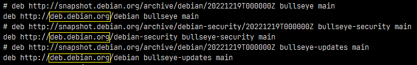
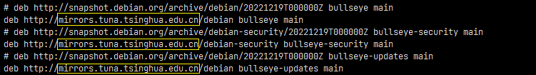

## 安装环境确认

### PostgreSQL 版本

链接 PostgreSQL 数据库，查看数据库版本号

```sql
SELECT version();
```

> 笔者的版本号为：
>
> PostgreSQL 12.13 (Debian 12.13-1.pgdg110+1) on x86_64-pc-linux-gnu, compiled by gcc (Debian 10.2.1-6) 10.2.1 20210110, 64-bit

### 查看已安装插件

查看 PostgreSQL 已安装插件

```sql
SELECT * FROM pg_extension;
```

### 可安装插件查询

查看 PostgreSQL 是否可安装 PostGIS 插件

```sql
SELECT * FROM pg_available_extensions WHERE name = 'postgis';
```

上述 sql 执行结果展示了 PostGIS 记录，则跳转到下下章节直接安装 PostGIS 插件，否则请参见下章节。

## docker 容器中安装 PostGIS 软件

### 进入 docker 容器

步骤1：查看 docker 容器的 IMAGE_ID

```shell
docker ps -a
```

步骤2：进入 docker 容器

```shell
docker exec -it {IMAGE_ID} /bin/bash
```

### Ubuntu 软件源更换为国内镜像源

步骤1：备份软件源配置：/etc/apt/sources.list

```shell
cp /etc/apt/sources.list /etc/apt/sources.list.bak
```

步骤2：使用 vi 命令将源域名改为：mirrors.tuna.tsinghua.edu.cn 或者 mirrors.aliyun.com



deb.debian.org 换为：mirrors.tuna.tsinghua.edu.cn



步骤3：更新软件包列表

```shell
apt update
apt-get update
```

### 安装 postgis

```shell
apt install -y postgis
```

### 安装 postgis-3-scripts

安装对应 PostgreSQL 版本的 postgresql-{version}-postgis-3-scripts，笔者的 PostgreSQL 版本是 12，则安装`postgresql-12-postgis-3-scripts`

```shell
apt install -y postgresql-12-postgis-3-scripts
```

## PostgreSQL 安装 PostGIS 插件

安装 PostGIS 插件 

```sql
CREATE EXTENSION postgis;
```

查看 PostGIS 版本

```sql
SELECT postgis_version();
```

查看 PostGIS 完整版本

```sql
SELECT postgis_full_version();
```